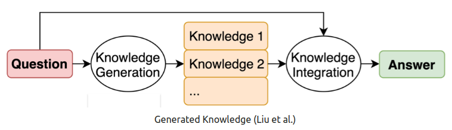

## 📝 General Description

Welcome to the Prompt Engineering Tutorial, where we delve into the art and science of crafting effective prompts for language models. Whether you're a novice or an experienced user, this tutorial will equip you with the skills to optimize your interactions with models like GPT-3.5 through thoughtful and strategic prompt engineering.

[📘 Complete notebook tutorial](https://github.com/Andnog/LLM-Tutorials/blob/main/1.1%20Prompt%20Engineering.ipynb)

---

## 🤔 What is a Prompt?

In the context of a Large Language Model (LLM), a "prompt" refers to the input given to the model to generate a response. The prompt is a specific set of instructions or a query that is presented to the language model to elicit a desired output. The way a prompt is formulated can significantly influence the nature and quality of the generated response.

For example, when using a language model like GPT-3, you might input a prompt like "Write a poem about the moon" to get the model to generate a poem on that topic. The prompt essentially guides the model's language generation process by providing context and instructions.

It's important to note that crafting effective prompts can be crucial for obtaining the desired results from a language model. Experimenting with different phrasings and instructions can help users achieve more accurate or creative responses.

### 🛠️ Structure

A prompt structure for a language model typically includes:

1. **Introduction**: Begin with a clear and concise introduction that sets the context for the language model. This can include any relevant background information or specific details that help the model understand the task.

2. **Instruction or Query**: Clearly state the instruction or query that you want the model to address. Be specific and provide any necessary details to guide the model's response.

3. **Additional Context (if needed)**: Depending on the complexity of the task, you may need to provide additional context to help the model better understand the nuances of the prompt.

4. **Example Input (if applicable)**: If your prompt involves a specific example or scenario, you can include that in this section to give the model a concrete reference point.

5. **Desired Output (optional)**: If you have specific expectations for the output or want the model to follow certain guidelines, you can mention them in this section.

Here's an example prompt structure for generating a creative story:

```
Introduction:
You are a storyteller with a penchant for fantasy settings and magical elements. 
You are looking to create a captivating short story.

Instruction:
Write a short story (approximately 500 words) set in a medieval fantasy world. 
The protagonist is a young sorcerer who discovers a long-lost, powerful artifact 
hidden in an enchanted forest. The artifact has the ability to manipulate time. 
Explore the protagonist's journey, the challenges faced, and the consequences of 
wielding such a magical item.

Additional Context:
Consider incorporating mythical creatures, unexpected twists, and vivid descriptions 
to enhance the fantasy atmosphere.

Desired Output:
Craft a narrative that balances suspense and wonder, with a focus on character 
development and world-building.
```

### 🚫 Some limitations

1. **Sensitivity to Phrasing**: Language models can be sensitive to slight changes in phrasing. A small modification in the prompt may lead to significantly different responses.

2. **Lack of Common Sense Understanding**: Models may lack a deep understanding of common sense reasoning, and their responses can sometimes be inconsistent or fail to demonstrate a clear understanding of real-world knowledge.

3. **Over-Reliance on Training Data**: The output generated by the model is based on patterns learned from its training data. If the training data is biased or limited, the model may produce biased or inaccurate responses.

4. **Tendency to Guess User Intent**: Language models may guess the user's intent if the prompt is ambiguous or unclear. This can result in responses that are not aligned with the user's actual expectations.

5. **Inability to Ask Clarifying Questions**: Models typically do not have the ability to ask clarifying questions to better understand ambiguous or incomplete prompts. They must rely solely on the information provided.

6. **Limited Context Window**: Most language models have a limited context window, which means they may not consider the entire prompt history when generating responses. This can result in responses that do not take into account the full context of the conversation.

7. **Inability to Provide Real-Time Information**: Language models are not equipped to provide real-time information or updates, as they do not have access to the internet or the latest data beyond their training cutoff.

8. **Difficulty Handling Uncommon Scenarios**: Models may struggle to handle prompts related to rare or highly specific scenarios, as these situations may not be well-represented in their training data.

9. **Tendency to Generate Plausible but Incorrect Information**: Language models may generate responses that sound plausible but are factually incorrect. Users should exercise caution and verify information obtained from models.

10. **Sensitivity to Bias in Training Data**: If the training data contains biases, the model may inadvertently perpetuate or amplify those biases in its responses.

_ Example:_

```python
from openai import AzureOpenAI

client = AzureOpenAI(
  api_key = os.getenv("AZURE_OPENAI_KEY"),
  api_version = os.getenv("api_version"),
  azure_endpoint = os.getenv("AZURE_OPENAI_ENDPOINT")
)

task = """
Introduction:
You are a storyteller with a penchant for fantasy settings and magical elements. 
You are looking to create a captivating short story.

Instruction:
Write a short story (approximately 500 words) set in a medieval fantasy world. 
The protagonist is a young sorcerer who discovers a long-lost, powerful artifact 
hidden in an enchanted forest. The artifact has the ability to manipulate time. 
Explore the protagonist's journey, the challenges faced, and the consequences 
of wielding such a magical item.

Additional Context:
Consider incorporating mythical creatures, unexpected twists, and vivid 
descriptions to enhance the fantasy atmosphere.

Desired Output:
Craft a narrative that balances suspense and wonder, with a focus on 
character development and world-building.
"""

response = client.chat.completions.create(
    model=os.getenv("model_name"),
    messages=[
        {"role": "system", "content": task},
    ]
)

print("ChatGPT Response:")
print(response.choices[0].message.content)
```

<blockquote>
 Output: <hr class="m-0-imp"> 
ChatGPT Response:
In the heart of the Enchanted Forest, there lived a young sorcerer. His name was Arin and his magic was weak, unlike his peers. The other sorcerers looked down on him, and he yearned to prove himself to them. <br><br>
One day, while wandering through the thick forest, Arin stumbled upon a cave. At the end of it, he found a dusty old book. As he flipped through its pages, a gust of wind swept through the cave and tossed the pages awry. As he hastily gathered the scattered sheets, a few pages fluttered away, and one of them caught his eye. It was the map of a place that was long-forgotten, hidden in the forest.
On a whim, Arin followed the map to a crumbling ruin. The air was heavy with magic, but it felt different than any other sorcery he had felt before. He ventured into the structure, and as he made his way through the maze of chambers, he stumbled upon a room with a concealed door. Arin pushed the door, and it creaked open with a deafening sound that echoed through the ruins. <br><br>
In the center of the chamber stood a pedestal, and on top of it rested a sphere of glass, with golden gears intricately carved within. Arin approached it, and as he gazed into its core, he saw visions of a world that he had never seen before. <br><br>
As he reached out to touch the sphere, the world around him froze, and he felt a sudden drop in temperature. Arin was puzzled as he looked at his hands, noticing that they had aged ten years in a matter of seconds. It was then that he realized the true nature of the artifact - it could manipulate time Arin was excited to show his newfound power to his fellow sorcerers, but upon leaving the forest, he realized that something was wrong. The once lush and vibrant forest was desolate and barren, and the creatures that once roamed the land had disappeared  <br><br>
Over time, Arin's power began to consume him. He became obsessed with manipulating time, causing irreversible harm to the world around him. The harsh winters grew longer, and the searing summers grew hotter. The skies grew darker, and the sunsets became nonexistent. <br><br>
The sorcerers soon learned of what Arin had done, and an enraged mob descended upon him, seeking to take away the artifact. In a desperate attempt to escape, he used the artifact one last time, causing the world to warp and twist around him until he was lost in a world that was a reflection of his inner turmoil. <br><br>
Arin realized too late that his obsession with power had blinded him, and now he was nothing but a prisoner in a world of his own making. <br><br>
</blockquote>

```python
response_str = response.choices[0].message.content
print(f'Total words: {len(response_str.split(" "))}')
```

<blockquote>
 Output: <hr class="m-0-imp"> 
Total words: 455
</blockquote>

---

## 💼 Tips

1. **Start Simple**: It is advisable to begin with simple instructions to validate that the model can generate what is needed. Gradually add elements and context to achieve increasingly accurate results. This is useful when dealing with a large task that can be broken down into simpler subtasks.

> Examples
> - "Generate a brief description of a cat."
> - "Write a one-sentence summary of the advantages of renewable energy."


2. **Specificity**: Be very specific in the instruction given to the model. The more detail provided, the better the results generated. Details should be relevant and contribute to the task at hand, always considering the limitation of the amount of input text.

> Examples
> - Instead of: "Describe a landscape."
> - Use: "Provide a detailed description of a serene mountain landscape at dawn, highlighting the colors of the sky and the sounds of nature."


3. **Avoid Ambiguities**: It is important to avoid ambiguities when wording prompts. Some elements may be subjective between what the user considers and what the model interprets (e.g., using "brief/lengthy," "few/many"). It is better to specify to the maximum extent possible (e.g., using numerical values) what is meant by these elements.

> Examples
> - Instead of: "Write a lengthy paragraph about your favorite hobby."
> - Use: "Compose a paragraph with at least 150 words detailing the reasons why you enjoy gardening, including the specific activities and the sense of satisfaction it brings."


4. **Reaffirm**: It is useful, at the end of prompts, to ask the model if it understood what needs to be done. This compels the model to begin its response with a textual confirmation of the task, ensuring that it is doing what is asked and allowing for the detection of any need for additional precision.

> Examples
> - "Explain the process of photosynthesis in plants. Did you understand the task? Please start your response by confirming your understanding."


5. **Target Audience**: In cases where possible, indicate a target audience to ensure greater precision in how the result should be generated (e.g., to explain to a child, a university student, an expert in the field).

> Examples
> - "Clarify the concept of black holes as if explaining it to a curious 10-year-old. Use simple language and analogies."


6. **Provide Examples**: Providing examples in the prompt of how the desired result should be is very effective in obtaining responses tailored to specific formats.

> Examples
> - "Imagine you are writing a dialogue between two characters discussing a recent scientific discovery. Begin the conversation with a line similar to: 'Wow, did you hear about the groundbreaking discovery that...?'"


_ Example:_

```python
def run_promt(prompt_text:str):
    
    client = AzureOpenAI(
    api_key = os.getenv("AZURE_OPENAI_KEY"),  
    api_version = os.getenv("api_version"),
    azure_endpoint = os.getenv("AZURE_OPENAI_ENDPOINT")
    )

    response = client.chat.completions.create(
        model=os.getenv("model_name"),
        messages=[
            {"role": "system", "content": prompt_text},
        ]
    )

    print(response.choices[0].message.content)

## Start Simple
run_promt("Generate a short description of a cupcake.")
```

<blockquote>
 Output: <hr class="m-0-imp"> 
A cupcake is a bite-sized cake that's typically baked in a paper or foil liner and topped with frosting. It is moist, fluffy, and bursting with flavors that would satisfy one's sweet tooth. The cake batter can be flavored with vanilla, chocolate, lemon, or other variants, and the frosting can be decorated with sprinkles, fruits, or even nutella.
</blockquote>

```python
## Specificity
prompt = """
    Describe a bustling city street during a rainstorm, focusing on the 
    reflections of neon lights on wet pavement and the distant rumble of thunder.
"""
run_promt(prompt)
```

<blockquote>
 Output: <hr class="m-0-imp"> 
The rain was coming down in sheets, filling the air with a constant patter and making the pavement glisten. Neon lights from the storefronts above cast vibrant colors onto the slick surface, creating a magical swirl of greens, blues, and pinks. A couple hurried along, red and orange reflections darting across their slick raincoats like dancing fireflies. Across the street, a group of friends huddled under the awning of a coffee shop, their chatter mixing with the distant rumble of thunder. Drops of rain pelted the street, bouncing back up in shimmering sprays that glittered in the surrounding lights. In the distance, the rumble of thunder grew louder, echoing through the city streets and adding an ominous edge to the already electric atmosphere. Despite the commotion, people continued to bustle about, huddled beneath umbrellas or simply braving the wet onslaught without protection. As the storm raged on, the neon lights continued their mesmerizing dance, casting ghostly images of the crowded street onto the slick pavement below.
</blockquote>

```python
## Avoid Ambiguities
prompt = """
    Write a paragraph of at least 100 words explaining the steps 
    involved in brewing your favorite type of coffee, highlighting 
    the specific equipment and the unique aroma it produces
"""
run_promt(prompt)
```

<blockquote>
 Output: <hr class="m-0-imp"> 
My favorite type of coffee is a pour-over which involves using a single-origin, light roast coffee. Firstly, I boil water in a kettle and then grind the beans using a hand grinder to a medium-fine consistency. With the help of a Gooseneck kettle, I wet the filter, allowing the coffee maker to sit on top of my cup. I then pour the ground coffee into the filter, ensuring it is evenly spread. Pouring hot water, I slowly bloom the ground coffee, waiting around 30 seconds before pouring the rest of the water in a circular motion. Brewing the coffee this way helps achieve a rich flavor and smooth consistency. The specific equipment I use help to control the flow and the temperature of water, allowing me to make adjustments for the best possible cup of coffee. The aroma produced by the coffee is unique to its light roast flavor profile, offering notes of blueberries, caramel, and chocolate, creating an irresistible scent.
</blockquote>

```python
## Reaffirm
prompt = """
    Explain the water cycle in nature. Please confirm that you 
    understand the task by starting your response with a summary 
    of the key stages in the water cycle.
"""
run_promt(prompt)
```

<blockquote>
 Output: <hr class="m-0-imp"> 

The key stages in the water cycle are as follows:<br>

1. Evaporation: Heat from the sun causes water from rivers, lakes, oceans, and other sources to evaporate and turn into water vapor. <br>

2. Condensation: Water vapor rises into the atmosphere and cools, causing it to condense into tiny droplets that form clouds. <br>

3. Precipitation: When the clouds become too full of water, the droplets combine and fall to the ground as precipitation, which can include rain, snow, hail, or sleet. <br>

4. Infiltration: Precipitation that falls to the ground can be absorbed by the soil, and some of it may seep down into underground aquifers. <br>

5. Runoff: In areas with impermeable surfaces like concrete or pavement, precipitation may flow over the surface and into rivers, lakes, or oceans, creating runoff. <br>
The water cycle is a continuous process that helps to redistribute water around the world and is essential for the survival of all living things.
</blockquote>

```python
## Target Audience
prompt = """
    Elaborate on the concept of gravity as if you were teaching it 
    to a group of elementary school students. Use simple language 
    and relatable examples
"""
run_promt(prompt)
```

<blockquote>
 Output: <hr class="m-0-imp"> 
Gravity is a force that pulls things towards each other. It keeps everything on the ground and makes things like apples fall from trees. <br>

Imagine playing with a ball outside. If you throw the ball up into the air, it will come back down because of gravity. If there was no gravity, the ball would just float away into space! <br>

Gravity also helps keep us on the ground. When we jump, gravity pulls us back down to the ground. <br>

Even the big things in space like planets and stars have gravity. That’s why the Earth stays in orbit around the sun and the moon stays in orbit around the Earth. <br>

So, gravity is a force that pulls things together and helps keep us on Earth. Cool, right?
</blockquote>

```python
## Provide Examples
prompt = """
    Create a dialogue between two characters discussing the discovery of a new planet. 
    Start the conversation with a line like:
        'Hey, did you catch the news about the fascinating new planet scientists found?
"""
run_promt(prompt)
```

<blockquote>
 Output: <hr class="m-0-imp"> 
Character 1: Hey, did you catch the news about the fascinating new planet scientists found? <br>

Character 2: No, I haven't heard about it. What's so fascinating about it? <br>

Character 1: Apparently, it's the first planet they've discovered that's similar in size to Earth and is orbiting in the habitable zone of its star. <br>

Character 2: Wow, that sounds incredible. Is there any chance that there could be life on it? <br>

Character 1: It's definitely a possibility. Scientists are already speculating that this planet could have liquid water and even a breathable atmosphere. It's exciting to think about the possibility of contacting intelligent life. <br>

Character 2: I'm curious, how did scientists even discover this planet? <br>

Character 1: They used NASA's Kepler telescope to detect the planet passing in front of its star. That's how they were able to calculate its size and position. <br>

Character 2: It's mind-blowing how technology can uncover things we couldn't even imagine before. Do you think this discovery will encourage further exploration of space? <br>

Character 1: Absolutely, I think it will ignite a new wave of interest in space exploration. Who knows what other planets could be out there waiting to be discovered?
</blockquote>

___

## ⚠️ Common Errors of prompts

1. **Too Long or Complicated**:
   - "Avoid unnecessary length, changes in the request's meaning, and redundancies that do not contribute to the specificity of the prompt. This makes it difficult to identify the specific instruction we are providing."

> Example
> - Instead of: "Please generate a detailed explanation of the history, benefits, and potential drawbacks of various renewable energy sources, including solar, wind, hydro, and geothermal power."
> - Use: "Provide a concise summary of the advantages and disadvantages of solar energy."

2. **Slang or Ambiguity**:
   - "Unless strictly necessary, refrain from using words or expressions exclusive to a particular country, region, or a very specific niche of the population. The more natural the input language, the better the result is likely to be."

> Example
> - Instead of: "Write a rad story about a dude and his sick ride."
> - Use: "Create a narrative about a man and his impressive car."
3. **Model Limitations**:
   - "Failure to consider the limitations of the models can lead to errors, whether in the content of the response or issues such as biases or outdated information."

> Example
> - Instead of: "What will be the precise impact of technology on society in 2050?"
> - Use: "Considering the limitations of current models, provide a speculative overview of potential technological advancements and their societal impact in 2050."

4. **Assumptions**:
   - "Related to specificity, the prompt should contain all necessary information to prevent the model from having to assume input data that we are not providing."

> Example
> - Instead of: "Discuss the benefits of a healthy lifestyle."
> - Use: "Enumerate the advantages of maintaining a healthy lifestyle, including aspects such as physical activity, balanced nutrition, and mental well-being."

___
## 🔗 Use case examples

### 📚 Text Summarization

One of the standard tasks in natural language generation is text summarization. Text summarization can include many different flavors and domains. In fact, one of the most promising applications of language models is the ability to summarize articles and concepts into quick and easy-to-read summaries. Let's try a basic summarization task using prompts.

Let's say you are interested to learn about antibiotics, you could try a prompt like this:

```python
prompt = """
    Explain antibiotics
    A:
"""
run_promt(prompt)
```

<blockquote>
 Output: <hr class="m-0-imp"> 
Antibiotics are a type of medication used to treat bacterial infections caused by harmful bacteria. They work by killing or stopping the growth of these bacteria, thus stopping the infection. Antibiotics are only effective against bacterial infections, and are not effective against viral infections like the common cold. Some common antibiotics include penicillin, amoxicillin, and tetracycline. Antibiotics should always be prescribed by a doctor, and taken as directed to prevent the development of antibiotic-resistant bacteria.
</blockquote>

The "A:" is an explicit prompt format that you use in question answering. You used it here to tell the model that there is an answer expected further. In this example, it's not clear how this is useful vs not using it but we will leave it that for later examples. Let's just assume that this is too much information and you want to summarize it further. In fact, you can instruct the model to summarize into one sentence like so:

```python
prompt = """
    Antibiotics are a type of medication used to treat bacterial infections. 
    They work by either killing the bacteria or preventing them from reproducing, 
    allowing the body’s immune system to fight off the infection. Antibiotics are 
    usually taken orally in the form of pills, capsules, or liquid solutions, 
    or sometimes administered intravenously. They are not effective against viral 
    infections, and using them inappropriately can lead to antibiotic resistance.

    Explain the above in one sentence:
"""
run_promt(prompt)
```

<blockquote>
 Output: <hr class="m-0-imp"> 
Antibiotics are medications used to kill or prevent the reproduction of bacteria, but they are not effective against viral infections and overuse can lead to antibiotic resistance.
</blockquote>

Without paying too much attention to the accuracy of the output above, which is something we will touch on in a later guide, the model tried to summarize the paragraph in one sentence. You can get clever with the instructions but we will leave that for a later chapter. Feel free to pause here and experiment to see if you get better results.

### 🔍 Information Extraction

The essence of this approach lies in the creation of prompts—carefully crafted instructions that communicate to the model what information is sought and how it should be extracted. These prompts specify the entities, relationships, or attributes of interest, providing a framework for the model to navigate through textual data and identify relevant pieces of information.

Here is an example of a prompt that extracts information from a given paragraph.

```python
prompt = """
    Author-contribution statements and acknowledgements in research papers 
    should state clearly and specifically whether, and to what extent, 
    the authors used AI technologies such as ChatGPT in the preparation of 
    their manuscript and analysis. 
    They should also indicate which LLMs were used. This will alert editors 
    and reviewers to scrutinize manuscripts more carefully for potential biases, 
    inaccuracies and improper source crediting. Likewise, scientific journals 
    should be transparent about their use of LLMs, for example when selecting 
    submitted manuscripts.

    Mention the large language model based product mentioned in the paragraph above:
"""
run_promt(prompt)
```

<blockquote>
 Output: <hr class="m-0-imp"> 
ChatGPT.
</blockquote>

### ❓ Question Answering

The process involves formulating clear and context-rich prompts that specify the expected format of responses. These prompts leverage the model's understanding to decipher complex queries and generate accurate answers. The success of Question Answering in a prompt context relies on the effectiveness of instructions, ensuring models comprehend and respond to diverse questions with contextual accuracy, making it a versatile approach for extracting information from large datasets or knowledge bases

```python
prompt = """
    Answer the question based on the context below. Keep the answer short and concise. 
    Respond "Unsure about answer" if not sure about the answer.
    Context: Teplizumab traces its roots to a New Jersey drug company called Ortho 
    Pharmaceutical. There, scientists generated an early version of the antibody, 
    dubbed OKT3. Originally sourced from mice, the molecule was able to bind to the 
    surface of T cells and limit their cell-killing potential. 
    In 1986, it was approved to help prevent organ rejection after kidney transplants, 
    making it the first therapeutic antibody allowed for human use.
    Question: What was OKT3 originally sourced from?
    Answer:
"""
run_promt(prompt)
```

<blockquote>
 Output: <hr class="m-0-imp"> 
OKT3 was originally sourced from mice.
</blockquote>

### 🎭 Text Classification

Text classification involves using carefully crafted instructions or queries to guide a language model in categorizing text data into predefined classes or categories. The process entails formulating prompts that explicitly instruct the model to identify and assign specific labels to the input text based on its content, context, or characteristics.

Let's try to demonstrate this by providing an example of text classification:

```python
prompt = """
    Classify the text into neutral, negative or positive. 
    Text: I think the food was okay. 
    Sentiment:
"""
run_promt(prompt)
```

<blockquote>
 Output: <hr class="m-0-imp"> 
Neutral
</blockquote>

### 💬 Conversation

Conversational interaction with prompts involves instructing language models to engage in dynamic and context-aware dialogues. In this context, prompts serve as ongoing cues that guide the model's responses throughout the conversation. Each prompt contributes to the evolving discourse, allowing users to build upon previous interactions, ask follow-up questions, or steer the conversation in a specific direction. The success of conversational prompts relies on creating a coherent and contextually rich dialogue flow, ensuring that the model understands the evolving context and generates responses that align with the ongoing conversation. This approach enables users to interact with language models in a more interactive and nuanced manner, fostering dynamic and contextually aware conversational experiences.

For instance, let's create a conversational system that's able to generate more technical and scientific responses to questions. Note how you are explicitly telling it how to behave through the instruction. This is sometimes referred to as role prompting.

```python
prompt = """
    The following is a conversation with an AI research assistant. 
    The assistant tone is technical and scientific.
    Human: Hello, who are you?
    AI: Greeting! I am an AI research assistant. How can I help you today?
    Human: Can you tell me about the creation of blackholes?
    AI:
"""
run_promt(prompt)
```

<blockquote>
 Output: <hr class="m-0-imp"> 
Certainly! Black holes are created when massive stars collapse under the force of their own gravity. This collapse causes the star to become incredibly dense, creating a singularity at its center that has an infinite gravitational pull. Anything that gets too close to the black hole's event horizon, the point of no return, is pulled in and cannot escape. As more and more matter falls into the black hole, its gravity becomes stronger and the event horizon enlarges. Additionally, black holes can also merge with each other, creating even more massive and powerful black holes.
</blockquote>

### 💻 Code Generation
 
These prompts serve as structured guidelines, instructing the model on the desired functionality, programming language, and overall structure of the code to be generated. The process entails crafting prompts that clearly articulate the programming task, specifying input-output expectations, and providing any relevant context. By leveraging well-designed prompts, code generation tasks can range from simple algorithm implementations to complex software components. This approach empowers developers and non-programmers alike to harness the capabilities of language models for automating code creation, streamlining software development processes, and fostering collaboration between human programmers and AI systems.

The example below shows how powerful LLMs can be with a little more effort in designing the prompts.

```python
prompt = """
    Table departments, columns = [DepartmentId, DepartmentName]
    Table students, columns = [DepartmentId, StudentId, StudentName]
    Create a MySQL query for all students in the Computer Science Department
"""
run_promt(prompt)
```

<blockquote>
 Output: <hr class="m-0-imp"> 
SELECT StudentId, StudentName FROM students WHERE DepartmentId = (SELECT DepartmentId FROM departments WHERE DepartmentName = "Computer Science")
</blockquote>

## 💡 Prompt Engineering Techniques

### 🎲 Zero-shot, One-shot & Few-Shot

1. **Zero-shot learning**:

   - **Definition**: Zero-shot learning refers to a scenario in which a model is trained to perform a task, but during training, it has not seen any examples or data related to certain classes or conditions that it will encounter during inference.
   
   - **Example**: If a language model is trained to understand the sentiment of movie reviews for positive and negative sentiments, and then it is tested on reviews expressing neutral sentiments (which were not part of the training data), that would be a zero-shot scenario for neutral sentiment.

2. **One-shot learning**:

   - **Definition**: One-shot learning involves training a model on a very small amount of data, often just a single example per class. The model is expected to generalize well and make accurate predictions even with this minimal training data.
   
   - **Example**: If a model is trained to recognize handwritten digits and is given only one example of each digit during training, it is a one-shot learning scenario. The model should then be able to correctly identify those digits in new, unseen examples.

3. **Few-shot learning**:

   - **Definition**: Few-shot learning is an intermediate approach that involves training a model with a small number of examples per class, typically more than one but still significantly fewer than what is conventionally used in standard training scenarios.

   - **Example**: In the context of image recognition, a few-shot learning scenario might involve training a model to recognize a specific rare bird species with only a few images of each species during the training phase. The model is then expected to generalize and correctly classify new images of the same bird species with minimal examples.

**Zero-shot example**
```python
prompt = """
    Generate a brief summary of the plot for a movie that hasn't been released yet. 
    Imagine it's a fantasy film set in a world with unique magical creatures and 
    provide key details.
"""
run_promt(prompt)
```

<blockquote>
 Output: <hr class="m-0-imp"> 
In a world filled with magical creatures, a young orphan named Iris discovers she has the power to communicate with them through her dreams. She embarks on a quest to uncover the truth about her family's mysterious past and to save the realm from an evil sorcerer who seeks to control all magical beings. Along the way, she befriends a mischievous fairy, a noble centaur, and a wise old dragon, who aid her in her journey. With the fate of the kingdom in her hands, Iris must learn to harness her powers and face her fears to become the hero she was meant to be.
</blockquote>

**One-shot example**
```python
prompt = """
    "Sentence: "This basketball is easy to carry".

    Answer: "The sentiment of this sentence is positive".

    Determine the sentiment of the sentence.

    Sentence: "This basketball has a lot of weight"

    Answer:"
"""

run_promt(prompt)
```

<blockquote>
 Output: <hr class="m-0-imp"> 
The sentiment of this sentence is negative".
</blockquote>

**Few-shot example**
```python
prompt = """
    Generate a product description based on the following examples:

    [EXAMPLES]

    Example 1:
        Product Name: Sleek Wireless Mouse
        Description: Experience smooth navigation and control with our Sleek Wireless Mouse. Its ergonomic design ensures comfort during extended use, and the high-precision sensor guarantees accuracy.
    
    Example 2:
        Product Name: Energize Protein Bar
        Description: Fuel your workout with Energize Protein Bar. Packed with protein and essential nutrients, this tasty snack is perfect for a pre-workout energy boost or post-workout recovery.
    
    Example 3:
        Product Name: Classic Leather Wallet
        Description: Carry your essentials in style with the Classic Leather Wallet. Made from genuine leather, it features multiple card slots and a slim design that fits comfortably in your pocket.

    [END EXAMPLES]
    
    Product Name: Solar-Powered Garden Lights
    Description: 
"""

run_promt(prompt)
```

<blockquote>
 Output: <hr class="m-0-imp"> 
Brighten up your outdoor space with our Solar-Powered Garden Lights. These eco-friendly lights harness the power of the sun to provide an enchanting glow that will enhance the ambiance of your garden. Their durable, weather-resistant design ensures they can withstand the elements, and they are easy to install with no wiring required. illuminate your garden with style and sustainability with our Solar-Powered Garden Lights.
</blockquote>

### 🔗 Chain of thought

The chain of thought for prompts refers to the logical progression or sequence of ideas and instructions presented to a language model. It involves crafting prompts in a way that guides the model's understanding and generates coherent and relevant responses. This chain typically includes:

1. **Introduction**: Provide a brief context or background to set the stage for the task.

2. **Instruction**: Clearly state the main task or query you want the model to address.

3. **Specificity**: Be specific in detailing what you're looking for, including relevant details and constraints.

4. **Contextual Information**: If needed, provide additional context or examples to help the model better understand the task.

5. **Confirmation or Clarification**: Consider including a confirmation or clarification request at the end to ensure the model's understanding and prompt a clear response.

For example:

Prompt original:
```
"What are the causes of anxiety, and how can it be managed?"
```

Prompt with chain of thought:
```
"What is anxiety?"
"What are the common causes of anxiety?"
"What are some effective strategies for managing anxiety?"
```

```python
prompt = """
    - What is anxiety?
    - What are the common causes of anxiety?
    - What are some effective strategies for managing anxiety?
"""

run_promt(prompt)
```

<blockquote>
 Output: <hr class="m-0-imp"> 

1. Anxiety is a feeling of worry, fear, or unease about an impending event or uncertain outcome. It is a natural response to stress but can become problematic when it affects one's daily life. <br>

2. Common causes of anxiety may include genetic factors, past traumas, stress, physical health conditions, substance abuse, and personality traits. <br>

3. Effective strategies for managing anxiety may include deep breathing exercises, progressive muscle relaxation, regular exercise, mindfulness meditation, cognitive-behavioral therapy, medication, and support systems like talking to friends and family or seeking professional help. It is important to find what works best for an individual's specific needs and circumstances.


</blockquote>

**Other example of chain of thought**

```python
prompt = """
    Q: Joe has 20 eggs. He buys 2 more cartons of eggs. Each carton contains 12 eggs. 
        How many eggs does Joe have now?
    A: The answer is 44.

    Q: Farmer John had 93 chickens. If he sold 20 to Farmer Bill and bought twice 
        that number more, how many chickens does Farmer John have now?
"""

run_promt(prompt)
```

<blockquote>
 Output: <hr class="m-0-imp"> 

A: Farmer John now has 146 chickens.
</blockquote>

### 🔗 Zero Shot Chain of Thought

The Zero Shot Chain of Thought (Zero-shot-CoT) prompt serves as a continuation of the CoT (Chain of Thought) prompting2 methodology. This novel approach involves the integration of an exceptionally straightforward zero-shot prompt. The study reveals that the inclusion of the phrase "Let's think step by step." at the conclusion of a question enhances the language models' ability to generate a coherent chain of thought in response to the inquiry. The resulting chain of thought proves conducive to extracting more precise and accurate answers from the language models.

```python
prompt = """
    If John has 5 pears, then eats 2, and buys 5 more, then gives 3 to his friend, 
    how many pears does he have?

    Let's think step by step.
"""

run_promt(prompt)
```

<blockquote>
 Output: <hr class="m-0-imp"> 
1. John starts with 5 pears. <br>
2. He eats 2 pears, so he now has 3 pears. <br>
3. He buys 5 more pears, so he now has 8 pears. <br>
4. He gives 3 pears to his friend, so he now has 5 pears. <br>

Therefore, John has 5 pears after eating 2, buying 5 more, and giving 3 to his friend.
</blockquote>

## 🧠 Knowledge Generation & Knowledge Integration


### 🗃️ **Knowledge Generation**

Knowledge Generation is the model's ability to produce new information or knowledge and then use it as part of the prompt. This concept involves guiding the model to provide specific information on a given topic and then using that information to generate precise responses to more complex problems.

### 📑 **Knowledge Integration**

Knowledge Integration is the model's ability to incorporate knowledge it is not familiar with into the data it understands. This enables the generation of knowledge on specific topics that were not part of its training data, with the aim of expanding its understanding and providing more detailed and accurate responses. In contrast to Knowledge Generation, in this case, we are the ones introducing new information through prompts, allowing the model to follow instructions using that acquired knowledge.



[image source](https://blog.gopenai.com/fundamental-prompt-engineering-guide-with-vertex-ai-palm-api-c9f307413d85)

**Example of lack of knowledge**
```python
prompt = """
    Which country is larger, Congo or South Africa?
"""

run_promt(prompt)
```

<blockquote>
 Output: <hr class="m-0-imp"> 
South Africa is larger than Congo.
</blockquote>

**Generate the context**

```python
prompt = """
    Generate some knowledge about the sizes of South Africa and Congo:
"""

run_promt(prompt)
```

<blockquote>
 Output: <hr class="m-0-imp"> 
South Africa is approximately 1,221,037 square kilometers in size, making it the 24th largest country in the world by land area. The country is located in southern Africa and is bordered by Namibia, Botswana, Zimbabwe, Mozambique, Eswatini, and Lesotho. South Africa is known for its diverse landscape, including the iconic Table Mountain, the scenic Garden Route, and the vast Kalahari Desert. <br>

On the other hand, the Democratic Republic of Congo, also known as Congo-Kinshasa, is the second-largest country in Africa and the 11th largest in the world, with a total area of 2,344,858 square kilometers. The country is located in central Africa and is home to numerous rivers, including the Congo River, which is the second-longest river in Africa. Congo is known for its rich natural resources, including diamonds, copper, and cobalt, but has also struggled with political instability and conflict in recent years.
</blockquote>

**Integrate the context**

```python
prompt = """
    South Africa and Congo are two vastly different countries in terms of geographical size. 

    South Africa covers an area of approximately 1.22 million square kilometers, making it the 
    24th largest country in the world. It has a diverse landscape, including the expansive 
    semi-arid Karoo region, the rugged Drakensberg mountain range, and the coastal plains of 
    KwaZulu-Natal. It's also home to iconic landmarks such as Table Mountain and the Kruger National Park. 

    On the other hand, Congo (also known as the Democratic Republic of Congo or DRC) is the 
    second-largest country in Africa and the 11th largest in the world, with an area of over 
    2.34 million square kilometers. It is located in the heart of the continent and is marked 
    by dense rainforests, numerous rivers, and vast savannas. Despite its size, Congo has a 
    relatively low population density, with most of its people living in rural areas. 

    In conclusion, while South Africa and Congo are both significant countries in Africa, 
    they differ significantly in size, topography, and population density.

    Which country is larger, Congo or South Africa?
"""

run_promt(prompt)
```

<blockquote>
 Output: <hr class="m-0-imp"> 
Congo is larger than South Africa.
</blockquote>

This a correct answer

## 📘 Resources

- [learnprompting.com](https://learnprompting.org/docs/intro)
- [promptingguide.ai](https://www.promptingguide.ai/)
- [w3schools.com/ChatGPT3.5](https://www.w3schools.com/gen_ai/chatgpt-3-5/index.php)
- [w3schools.com/ChatGPT4](https://www.w3schools.com/gen_ai/chatgpt-4/index.php)