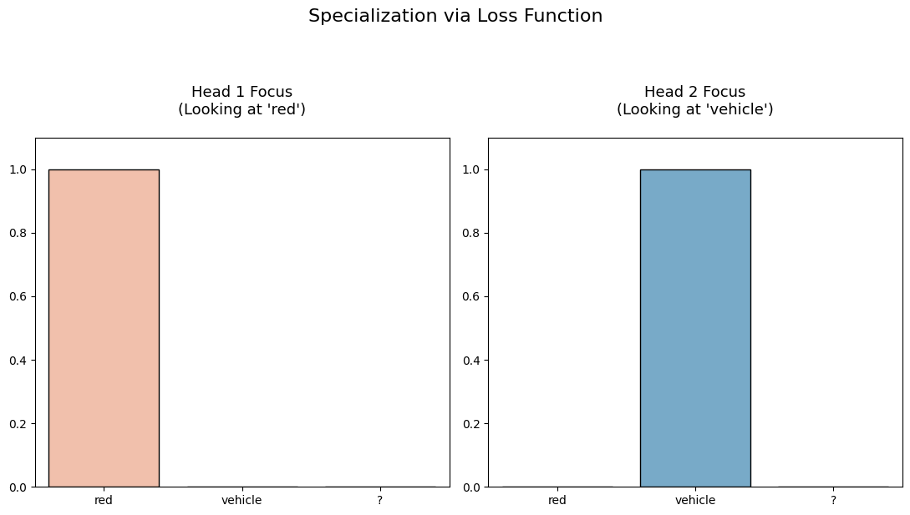

## 📝 General Description

Welcome to this comprehensive guide on understanding the **Transformer architecture** from scratch and in depth.

In this tutorial, we will break down the core components of the Transformer model, including self-attention, multi-head attention, positional encoding, encoder-decoder structure, and more. Each part of the architecture will be demonstrated step-by-step in Python, ensuring you gain practical experience with hands-on code examples. To further reinforce your understanding of how Transformers process and generate language, we will also provide visual aids, diagrams, and external resources.

By the end of this guide, you’ll not only grasp how modern language models like GPT and BERT are structured, but you’ll also be able to implement the essential parts yourself. This will give you practical insight into one of the most significant breakthroughs in AI.

Let's embark on this journey to demystify Transformers—one piece and one line of code at a time!

---

## 🤖 What is a Transformer?

In simple terms, a Transformer is a deep learning architecture specifically created to handle sequential data such as text, but unlike traditional models like RNNs or LSTMs which process data step by step, **Transformers introduce a groundbreaking mechanism: they process all elements of the input sequence simultaneously.**

**The Old Way (RNNs/LSTMs) vs. The Transformer Way**
* RNNs (Sequential): Imagine reading a sentence one word at a time through a small hole in a piece of paper. You have to remember the first word by the time you reach the last. If the sentence is long, you forget the context. This is slow (cannot be parallelized).

* Transformers (Parallel): Imagine looking at the whole sentence at once. You can instantly see how the first word relates to the last word. This allows for massive parallelization (speed) and retaining long-term context (accuracy).

### 🛠️ General Structure

**The Secret Sauce:**

➡️ The core mechanism that makes this work is **Self-Attention.**

It allows the model to look at every word in a sentence simultaneously and decide which words are important relative to the current word.

> Example: "The animal didn't cross the street because it was too tired."

When the model processes the word "it", Self-Attention tells the model:

1. Pay high attention to "animal" (because "it" refers to the animal).
1. Pay low attention to "street".

❗Without attention, the computer wouldn't know if "it" meant the street or the animal.

**Encoder and Decoder:**

The original Transformer (from the "Attention Is All You Need" paper) has two distinct stacks:

* **Encoder**: It takes the English text, processes it, and **compresses it into a purely mathematical (Numerical Matrix) understanding of the meaning (context)**.
* **Decoder**: It takes that mathematical meaning and generates the translated text (e.g., into Spanish), **predicting one word at a time based  on the Encoder's context**.


Visual example

---

## 📚 Embeddings & Positional Encoding

### Input Embeddings

**Computers can't read text.** We assign every word in our vocabulary a specific index (e.g., "AI" = 42). However, indices don't capture meaning.
An **Embedding Layer** turns that index into a vector of size $d_{model}$ (usually 512). This vector is learned during training so that words with similar meanings end up mathematically close to each other.


Example of basic embedding word and similar meaning representation

<blockquote>
🎁 BONUS: How Embeddings Learn Meaning 🎁 <hr class="m-0-imp"> 

<br>
At the very beginning, the embedding for "Cat", "Dog", and "Apple" are just random numbers.

The model learns meaning through Context (The Distributional Hypothesis).

1. The Task: Imagine giving the model thousands of sentences like:
    - "I went to the park to walk my ____."
    - "The ____ barked at the mailman."

1. The Error: If the model guesses "Apple" for the blank, the error is high. If it guesses "Dog", the error is low.

1. The Update: To reduce error, the model mathematically nudges the numbers for "Dog" closer to the numbers for "walk" and "bark".

1. The Result: Since "Cat" and "Dog" appear in very similar surroundings (pets, fur, walking), their numbers eventually become almost identical. "Apple" appears in sentences about eating or trees, so its numbers move to a completely different part of the mathematical space.

**In short:** Words that share **neighbors** become **neighbors** in the vector space.
</blockquote>


**Tokenizing** simply chops text into pieces (IDs). **Embedding** maps those IDs into a vector space, literally "embedding" discrete words into a continuous mathematical dimension to **capture meaning**.


### Positional Encoding

This is the clever part. Because the **Transformer looks at all words at once, it has no idea that "The" comes before "End".** It sees them purely as a "bag of words."

We must inject information about the **position** of each word into the embedding vector.

**The Strategy:** We add a constant vector to each embedding vector. This specific vector follows a specific wave pattern (Sine and Cosine functions) based on the position.

The formula used in the paper is:
$$PE_{(pos, 2i)} = \sin(pos / 10000^{2i/d_{model}})$$
$$PE_{(pos, 2i+1)} = \cos(pos / 10000^{2i/d_{model}})$$

* PE: Position encoding.
* pos: The position of the word in the sentence.
* i: The dimension index of the embedding vector.


### 💻 Practical Demo

Before building the complex Transformer, we must prove that a computer can learn semantic meaning (e.g., that "Cat" is similar to "Dog") purely from math.

In this script, we will:

1. Create a tiny dataset of few sentences.

1. Train a simple Neural Network to predict the next word.

1. Visualize the result to see "Animals" and "Fruits" separate into different clusters.


_ Example:_

```python
import torch
import torch.nn as nn
import matplotlib.pyplot as plt
import numpy as np
from sklearn.metrics.pairwise import cosine_similarity

# 0. SET SEED (For consistent results)
torch.manual_seed(123)

# --- 1. The Dataset ---
# We strip it down to pure concepts to avoid "Stopword Noise"
sentences = [
    "cat strolls", "cat eats", "cat walks", "cat runs",
    "dog runs", "dog eats", "dog likes", "dog walks",
    "apple fruit", "apple sweet", "apple kitchen",
    "banana fruit", "banana ripe", "banana kitchen"
]

# Vocabulary
words = set(" ".join(sentences).split())
# Sorting ensures index 0 is always the same word every time we run
word2idx = {w: i for i, w in enumerate(sorted(list(words)))}
idx2word = {i: w for w, i in word2idx.items()}
vocab_size = len(words)

# --- 2. The Model (Prediction based) ---
class WordPredictionModel(nn.Module):
    def __init__(self, vocab_size, d_model=2):
        super().__init__()
        self.embed = nn.Embedding(vocab_size, d_model)
        self.linear = nn.Linear(d_model, vocab_size) 
    
    def forward(self, x):
        return self.linear(self.embed(x))

model = WordPredictionModel(vocab_size, d_model=2)
optimizer = torch.optim.Adam(model.parameters(), lr=0.02)
criterion = nn.CrossEntropyLoss()

# --- 3. Training Data ---
inputs_list = []
targets_list = []

for s in sentences:
    w = s.split()
    # "cat" -> "strolls" AND "strolls" -> "cat"
    inputs_list.append(word2idx[w[0]])
    targets_list.append(word2idx[w[1]])
    inputs_list.append(word2idx[w[1]])
    targets_list.append(word2idx[w[0]])

inputs = torch.tensor(inputs_list)
targets = torch.tensor(targets_list)

# --- 4. Training ---
print("Training...")
for epoch in range(300):
    optimizer.zero_grad()
    output = model(inputs)
    loss = criterion(output, targets)
    loss.backward()
    optimizer.step()
    
    if epoch % 100 == 0:
        print(f"Epoch {epoch}: Loss {loss.item():.4f}")

# --- 5. NUMERICAL PROOF (The Missing Part) ---

def get_vec(word):
    return model.embed.weight[word2idx[word]].detach().numpy()

print("\n" + "="*40)
print("     NUMERICAL PROOF")
print("="*40)

# A. Raw Vectors
print("\n[A] Raw Vector Values (2 Dimensions):")
for w in ["cat", "dog", "apple", "banana"]:
    v = get_vec(w)
    print(f"  {w:10}: [{v[0]:.4f}, {v[1]:.4f}]")

# B. Similarity Scores
print("\n[B] Cosine Similarity (1.0 = Same, -1.0 = Opposite):")

def print_sim(w1, w2):
    v1 = get_vec(w1).reshape(1, -1)
    v2 = get_vec(w2).reshape(1, -1)
    sim = cosine_similarity(v1, v2)[0][0]
    print(f"  {w1} <-> {w2}: {sim:.4f}")

print_sim("cat", "dog")       # Should be HIGH (e.g., > 0.9)
print_sim("apple", "banana")  # Should be HIGH (e.g., > 0.9)
print_sim("cat", "apple")     # Should be LOW (e.g., < 0.5 or negative)

# --- 6. VISUALIZATION ---
vectors = model.embed.weight.detach().numpy()

plt.figure(figsize=(10, 8))
plt.scatter(vectors[:,0], vectors[:,1], c='white', s=1) # Invisible anchors

for i, word in idx2word.items():
    x, y = vectors[i]
    # Color logic: Animals=Blue, Food=Red, Actions=Green
    if word in ['cat', 'dog']: color = 'blue'
    elif word in ['apple', 'banana']: color = 'red'
    else: color = 'green'
    
    plt.text(x, y, word, fontsize=12, color=color, fontweight='bold', ha='center')
    plt.scatter(x, y, c=color, alpha=0.1, s=300)

plt.title("Final Learned Embeddings")
plt.grid(True, linestyle='--', alpha=0.5)
plt.show()
```

<blockquote>
 Output: <hr class="m-0-imp"> 
</blockquote>

```
Training...
Epoch 0: Loss 2.7137
Epoch 100: Loss 1.0664
Epoch 200: Loss 0.9315

========================================
     NUMERICAL PROOF
========================================

[A] Raw Vector Values (2 Dimensions):
  cat       : [-1.4200, 3.3785]
  dog       : [-3.2353, 1.6622]
  apple     : [-3.3249, -1.6699]
  banana    : [-1.7500, -3.6377]

[B] Cosine Similarity (1.0 = Same, -1.0 = Opposite):
  cat <-> dog: 0.7659
  apple <-> banana: 0.7919
  cat <-> apple: -0.0675
```


## 🧠 The Self-Attention Mechanism

### What is Self-Attention?

In the previous section, we learned that Embeddings give words meaning. However, **Embeddings are static**. The word "Bank" has the same embedding vector whether we say "I sat by the river bank" or "I deposited money in the bank".

**Self-Attention** is the mechanism that gives words **context**. It allows every word in a sentence to look at every other word and decide: "How much does this other word matter to me?"

**Solution: Query, Key, and Value**
To achieve this, we don't just use the word embedding directly. We create three new vectors for every word using three separate linear layers (weights):

1. Query (Q): What the token is looking for. (e.g., "I am 'it', I am looking for the noun I refer to.")

1. Key (K): What the token identifies as. (e.g., "I am 'cat', I am a noun/animal.")

1. Value (V): The actual information the token contains.

<blockquote>
💡 The Analogy: The Filing System
Imagine you are in a library.

- Query: The sticky note you have that says "Biology".

- Key: The label on the spine of every book on the shelf ("History", "Math", "Biology").

- Value: The content inside the book.

-> You match your Query against the Keys. When you find a match (High Similarity), you take the Value (content) and add it to your knowledge.
</blockquote>


**👩‍🔬 Formula:**

How do we calculate "similarity" between a Query and a Key? We use the **Dot Product**.

The formula for Scaled Dot-Product Attention is:

$$Attention(Q, K, V) = \text{softmax}\left(\frac{QK^T}{\sqrt{d_k}}\right)V$$

1. $QK^T$: Multiply Queries by Keys to get a score matrix (Similarity). 
1. $\sqrt{d_k}$: Scale down the numbers so gradients remain stable (hence "Scaled").
1. Softmax: Convert scores into probabilities (0 to 1). If the score is high, this becomes near 1 (pay attention!). If low, near 0 (ignore).
1. $\times V$: Multiply the probability by the Values. We keep the information of relevant words and drown out the irrelevant ones.


### 💻 Practical Demo

To prove Self-Attention works, we need a problem that cannot be solved by looking at just one word. We need context ambiguity.

Task: "Ambiguous Pairs"

We will train a model to classify 2-word phrases.

* **"Fruit Fly"** -> Class: **Insect**
* **"Fruit Salad"** -> Class: **Food**
* **"Iron Man"** -> Class: **Hero**
* **"Iron Gate"** -> Class: **Metal**

**The Trick:**
We will force the model to make the prediction using **ONLY the vector of the first word** (e.g., "Fruit").

* By itself, "Fruit" could be Insect or Food. It doesn't know.
* To solve this, the Self-Attention mechanism **MUST** learn to "look" at the second word ("Fly" or "Salad") and copy that information back to the first word.

If the Attention Map shows the first word looking at the second, we have proven it works.

_ Example:_

```python
import torch
import torch.nn as nn
import torch.nn.functional as F
import seaborn as sns
import matplotlib.pyplot as plt

# 0. SET SEED
torch.manual_seed(42)

# --- 1. DATASET: AMBIGUOUS PAIRS ---
# Sentences with labels
data = [
    ("fruit fly", 0),   # 0 = Insect
    ("fruit salad", 1), # 1 = Food
    ("iron man", 2),    # 2 = Hero
    ("iron gate", 3)    # 3 = Metal
]

# Build Vocabulary
words = set()
for s, _ in data:
    words.update(s.split())
word2idx = {w: i for i, w in enumerate(sorted(list(words)))}
idx2word = {i: w for w, i in word2idx.items()}
vocab_size = len(words)

# Prepare Tensors
inputs = []
labels = []
for s, label in data:
    # Convert "fruit fly" -> [ID_fruit, ID_fly]
    inputs.append([word2idx[w] for w in s.split()])
    labels.append(label)

inputs = torch.tensor(inputs)  # Shape: (4, 2)
labels = torch.tensor(labels)  # Shape: (4)

# --- 2. THE MODEL WITH SELF-ATTENTION ---
class TinyTransformer(nn.Module):
    def __init__(self, vocab_size, d_model):
        super().__init__()
        self.d_model = d_model
        
        # A. Embeddings (The Meaning)
        self.embed = nn.Embedding(vocab_size, d_model)
        
        # B. Self-Attention (The Context)
        # We produce Queries, Keys, and Values
        self.W_q = nn.Linear(d_model, d_model, bias=False)
        self.W_k = nn.Linear(d_model, d_model, bias=False)
        self.W_v = nn.Linear(d_model, d_model, bias=False)
        
        # C. Classifier
        self.fc = nn.Linear(d_model, 4) # 4 Classes

    def forward(self, x):
        # 1. Embed: (Batch, Seq_Len, d_model)
        # e.g., "fruit fly" -> [Vector_Fruit, Vector_Fly]
        emb = self.embed(x) 
        
        # 2. Compute Q, K, V
        Q = self.W_q(emb)
        K = self.W_k(emb)
        V = self.W_v(emb)
        
        # 3. Dot Product Similarity (The "Match")
        # Score = Q * K_transpose
        scores = torch.matmul(Q, K.transpose(-2, -1)) / (self.d_model ** 0.5)
        
        # 4. Attention Weights (Softmax)
        attn_weights = F.softmax(scores, dim=-1)
        
        # 5. Weighted Sum (The Transfer of Info)
        context = torch.matmul(attn_weights, V)
        
        # --- THE CONSTRAINT ---
        # We ONLY use the vector of the FIRST word (Index 0) to classify.
        # This forces the first word to "attend" to the second word to get the answer.
        first_word_context = context[:, 0, :] 
        
        output = self.fc(first_word_context)
        
        return output, attn_weights

# Initialize
model = TinyTransformer(vocab_size, d_model=8)
optimizer = torch.optim.Adam(model.parameters(), lr=0.01)
criterion = nn.CrossEntropyLoss()

# --- 3. TRAINING LOOP ---
print("Training: Teaching 'Fruit' to look at 'Fly'...")

for epoch in range(200):
    optimizer.zero_grad()
    
    predictions, attn_weights = model(inputs)
    loss = criterion(predictions, labels)
    
    loss.backward()
    optimizer.step()
    
    if epoch % 50 == 0:
        print(f"Epoch {epoch} | Loss: {loss.item():.4f}")

# --- 4. VISUALIZATION ---
# Let's see what the model learned!
print("\nTesting: Does 'Iron' look at 'Man'?")

# Pass "iron man" through the trained model
test_sentence = "iron man"
test_in = torch.tensor([[word2idx[w] for w in test_sentence.split()]])
_, weights = model(test_in)

# Plot the Attention Matrix
# Shape of weights: (1, 2, 2) -> We take the first batch
matrix = weights[0].detach().numpy() 

plt.figure(figsize=(6, 5))
labels = test_sentence.split()
sns.heatmap(matrix, annot=True, cmap="Reds", 
            xticklabels=labels, yticklabels=labels,
            cbar_kws={'label': 'Attention Intensity'})

plt.title(f"Attention Weights for '{test_sentence}'\nCheck the first row!")
plt.xlabel("Key (Looking at...)")
plt.ylabel("Query (Word from...)")
plt.show()
```

<blockquote>
 Output: <hr class="m-0-imp"> 
</blockquote>

```
Training: Teaching 'Fruit' to look at 'Fly'...
Epoch 0 | Loss: 1.4035
Epoch 50 | Loss: 0.0023
Epoch 100 | Loss: 0.0008
Epoch 150 | Loss: 0.0005

Testing: Does 'Iron' look at 'Man'?
```


🔍 **How to Read the Result**

1. Look at the **First Row** (labeled "iron").
2. The model is trying to classify the phrase based *only* on this position.
3. **Self-Attention:** If the box for **"iron"  "iron"** is light (low number) and **"iron"  "man"** is dark red (high number, like 0.8 or 0.9), **it worked.**
4. It proves the word "Iron" stopped looking at itself and paid attention to "Man" to understand that the context is "Hero".

**Why did Dot Product do this?**
During training, the dot product between "Iron" (Query) and "Man" (Key) was the only mathematical path to lower the error. The model adjusted the weights until those two vectors pointed in the same direction, maximizing their similarity score.


## 🐙 Multi-Head Attention

### Why One "Head" Isn't Enough

In the previous section, our model successfully connected "Iron" to "Man". But language is rarely that simple. A single word often has multiple simultaneous relationships.

Consider the sentence:

> The animal didn't cross the street because it was too tired.

When the model looks at **"it"**, it needs to understand two things at once:

1. **Grammar:** "it" is the subject of "was".
2. **Meaning:** "it" refers to "animal" (not "street").

A single Attention mechanism (one "Head") might get overwhelmed trying to do both. **Multi-Head Attention** gives the model multiple "brains" to focus on different things simultaneously.

* **Head 1:** Focuses on **Who** (connects "it" to "animal").
* **Head 2:** Focuses on **Action** (connects "it" to "cross").
* **Head 3:** Focuses on **Punctuation** (connects "it" to ".").

### The Strategy: Split and Conquer

Instead of one giant matrix of size 512, we split it into smaller matrices (e.g., 8 heads of size 64).

1. **Split:** Divide the embedding into  parts.
2. **Attend:** Run Self-Attention on each part independently (in parallel).
3. **Concatenate:** Glue the results back together.
4. **Mix:** Pass through a final Linear Layer to Combine the insights.


_ Example:_

```python
import torch
import torch.nn as nn
import torch.nn.functional as F
import seaborn as sns
import matplotlib.pyplot as plt
import numpy as np

# 0. SET SEED (For consistent initialization)
torch.manual_seed(42)

# --- 1. DATASET ---
data = [
    (["red", "fruit", "?"], "apple"),     
    (["yellow", "fruit", "?"], "banana"), 
    (["red", "vehicle", "?"], "ferrari"), 
    (["yellow", "vehicle", "?"], "bus"),  
]

# Vocabulary
words = set()
for seq, target in data:
    words.update(seq)
    words.add(target)
    
word2idx = {w: i for i, w in enumerate(sorted(list(words)))}
idx2word = {i: w for w, i in word2idx.items()}
vocab_size = len(words)

inputs = torch.tensor([[word2idx[w] for w in seq] for seq, _ in data])
targets = torch.tensor([word2idx[t] for _, t in data])

# --- 2. MODEL ---
class RegularizedMultiHead(nn.Module):
    def __init__(self, vocab_size, d_model, num_heads):
        super().__init__()
        self.d_model = d_model
        self.num_heads = num_heads
        self.d_k = d_model // num_heads 
        
        self.embed = nn.Embedding(vocab_size, d_model)
        self.W_q = nn.Linear(d_model, d_model, bias=False)
        self.W_k = nn.Linear(d_model, d_model, bias=False)
        self.W_v = nn.Linear(d_model, d_model, bias=False)
        self.W_o = nn.Linear(d_model, d_model, bias=False)
        self.fc = nn.Linear(d_model, vocab_size)

    def forward(self, x):
        b, s = x.size()
        emb = self.embed(x) 
        
        # Split Heads
        Q = self.W_q(emb).view(b, s, self.num_heads, self.d_k).transpose(1, 2)
        K = self.W_k(emb).view(b, s, self.num_heads, self.d_k).transpose(1, 2)
        V = self.W_v(emb).view(b, s, self.num_heads, self.d_k).transpose(1, 2)
        
        # Attention
        scores = torch.matmul(Q, K.transpose(-2, -1)) / (self.d_k ** 0.5)
        attn_weights = F.softmax(scores, dim=-1) 
        
        context = torch.matmul(attn_weights, V)
        context = context.transpose(1, 2).contiguous().view(b, s, self.d_model)
        
        # Classification (Only on last token)
        final_output = self.W_o(context)
        return self.fc(final_output[:, -1, :]), attn_weights

model = RegularizedMultiHead(vocab_size, d_model=64, num_heads=2)
optimizer = torch.optim.Adam(model.parameters(), lr=0.01)
criterion = nn.CrossEntropyLoss()

# --- 3. TRAINING WITH REGULARIZATION ---
print("Training with Disagreement Penalty...")

for epoch in range(300):
    optimizer.zero_grad()
    preds, weights = model(inputs)
    
    # A. Classification Loss
    cls_loss = criterion(preds, targets)
    
    # B. Disagreement Penalty (The Magic Trick)
    # We take the attention weights of Head 0 and Head 1
    # We multiply them. If both are high (overlap), the result is high.
    # We want to MINIMIZE this overlap.
    # Focus on the last token's attention (index 2) looking at input words
    head0 = weights[:, 0, 2, :] # (Batch, Seq)
    head1 = weights[:, 1, 2, :] # (Batch, Seq)
    overlap = (head0 * head1).sum() 
    
    # Total Loss = Learn Task + Don't Overlap
    total_loss = cls_loss + (0.5 * overlap)
    
    total_loss.backward()
    optimizer.step()
    
    if epoch % 50 == 0:
        acc = (preds.argmax(dim=1) == targets).float().mean()
        print(f"Epoch {epoch} | Loss: {total_loss.item():.4f} | Acc: {acc:.0%}")

# --- 4. VISUALIZATION ---
test_seq = ["red", "vehicle", "?"]
test_in = torch.tensor([[word2idx[w] for w in test_seq]])
_, weights = model(test_in)

# Extract attention for the "?" token (Query index 2)
h1 = weights[0, 0, 2, :].detach().numpy()
h2 = weights[0, 1, 2, :].detach().numpy()

# Set up the figure
fig, ax = plt.subplots(1, 2, figsize=(11, 6))
tokens = test_seq

# Plot Head 1
sns.barplot(x=tokens, y=h1, ax=ax[0], palette="Reds", edgecolor='black')
# Added 'pad=20' for vertical spacing between title and plot
ax[0].set_title(f"Head 1 Focus\n(Looking at '{tokens[np.argmax(h1)]}')", fontsize=13, pad=20)
ax[0].set_ylim(0, 1.1)

# Plot Head 2
sns.barplot(x=tokens, y=h2, ax=ax[1], palette="Blues", edgecolor='black')
# Added 'pad=20' for vertical spacing between title and plot
ax[1].set_title(f"Head 2 Focus\n(Looking at '{tokens[np.argmax(h2)]}')", fontsize=13, pad=20)
ax[1].set_ylim(0, 1.1)

# Adjust 'y' to move the main title higher
plt.suptitle("Specialization via Loss Function", fontsize=16, y=1.02)

# Use tight_layout with a top margin to prevent titles from crashing
plt.tight_layout(rect=[0, 0, 1, 0.95]) 

plt.show()
```

<blockquote>
 Output: <hr class="m-0-imp"> 
</blockquote>

```
Training with Disagreement Penalty...
Epoch 0 | Loss: 2.8449 | Acc: 25%
Epoch 50 | Loss: 0.0000 | Acc: 100%
Epoch 100 | Loss: 0.0000 | Acc: 100%
Epoch 150 | Loss: 0.0000 | Acc: 100%
Epoch 200 | Loss: 0.0000 | Acc: 100%
Epoch 250 | Loss: 0.0000 | Acc: 100%
```




## 🏗️ Feed-Forward Networks (FFN)

While Multi-Head Attention routes information between tokens, it doesn't actually "process" that information. The **Feed-Forward Network** acts as a localized processor for every single word in the sequence.

Think of Multi-Head Attention as a group of people in a meeting sharing notes. The Feed-Forward Network is like each person going back to their desk to think deeply about the notes they just received.

* **Independent Processing:** The FFN is applied to each word position separately and identically. It has no idea what the other words are doing; it only focuses on the rich context vector it just received from the attention layer.
* **Expansion & Contraction:** Internally, this layer usually projects the data into a much higher dimension (e.g., from 512 to 2048) using a ReLU activation, and then projects it back down. This "stretching" of the data allows the model to learn complex non-linear patterns.


---

## ⚖️ Layer Normalization

Deep neural networks are notoriously difficult to train because numbers can grow exponentially large or shrink to zero as they pass through many layers (the vanishing/exploding gradient problem). **Layer Normalization** is the "stabilizer."

It ensures that the output of each layer has a consistent mean and variance. By keeping the mathematical values within a healthy range, the model trains much faster and is less likely to "break" during the learning process.


---

## ➕ Residual Connections (Add & Norm)

You will often see the term "Add & Norm" in Transformer diagrams. This refers to **Residual Connections** (also called Skip Connections).

Instead of just passing the output of a layer to the next, we **add** the original input back to the output of the layer:

**Why do this?**

* **Information Highway:** It allows the original signal to flow through the network without being distorted by every single layer.
* **Easier Training:** It helps gradients flow backward during training, preventing the model from "forgetting" the initial input as the network gets deeper.


---

## 🧱 The Transformer Block: Putting it Together

At this point, we have all the ingredients for a single **Transformer Block**. A full model (like GPT or BERT) is simply a stack of these blocks (often 6, 12, or even 96 layers deep).

**The flow of one block looks like this:**

1. **Input** arrives (as embeddings + positional encodings).
2. **Multi-Head Attention** looks for relationships.
3. **Add & Norm** stabilizes the attention output.
4. **Feed-Forward Network** processes the information at each position.
5. **Add & Norm** stabilizes the final result before passing it to the next block.


## 🏛️ The Architecture: Encoder vs. Decoder

The original Transformer was designed for translation (e.g., English to Spanish). To do this, it uses two distinct "teams" working together.

### 1. The Encoder (The Reader)

The Encoder’s job is to understand the input sentence. It looks at the whole English sentence at once and creates a high-level mathematical representation of its meaning.

* **Bi-directional:** It can look at words to the left and right of any given word to get full context.
* **Output:** A set of vectors that represent the "essence" of the input.

### 2. The Decoder (The Writer)

The Decoder’s job is to generate the output sentence one word at a time. It is slightly more complex than the Encoder because it has to look at two things:

1. What has already been written (to maintain the flow of the new sentence).
2. The Encoder's output (to make sure the translation is accurate).


---

## 🎭 The Secret of the Decoder: Masked Attention

There is a major difference in how the Decoder "thinks." When the Decoder is predicting the next word, it is **not allowed** to see the future.

Imagine you are translating "The cat" into "El gato."

* When the model is predicting "El", it shouldn't be able to see that the next word is "gato."
* If it could see the future, it would just copy the answer instead of learning how to translate.

To prevent this, we use **Masked Multi-Head Attention**. We mathematically "mask" (hide) all words that come after the current position by setting their attention scores to negative infinity (). This ensures the model only learns from the past.

> **Example: Masking in Transformer Prediction**
> 
> Suppose the Decoder is predicting the next word in the sequence:  
> `"The cat sat ___"`
> 
> The model should only be able to "see" the words up to the blank (including the blank), not the words that come after it. To enforce this restriction, a **mask** is applied to the attention scores so that each position can only attend to previous (or current) positions, never to future positions.
> 
> Here's what a simple mask would look like when predicting 4 positions (visualized as a matrix where 0 = allowed, -inf = masked):
> 
> |       | w1 | w2 | w3 | w4 |
> |-------|----|----|----|----|
> | **w1** |  0 | -∞ | -∞ | -∞ |
> | **w2** |  0 |  0 | -∞ | -∞ |
> | **w3** |  0 |  0 |  0 | -∞ |
> | **w4** |  0 |  0 |  0 |  0 |
> 
> When predicting the third word ("w3"), for example, the model CANNOT "see" w4. In code, this is achieved by adding a mask (typically a matrix filled with `-inf` above the diagonal) so the softmax output ignores future positions.
> 
> **PyTorch Example:**
> ```python
> import torch
> 
> seq_len = 4
> mask = torch.triu(torch.ones(seq_len, seq_len), diagonal=1) * float('-inf')
> print(mask)
> ```
> This produces:
> ```
> tensor([[0., -inf, -inf, -inf],
>         [0.,   0., -inf, -inf],
>         [0.,   0.,   0., -inf],
>         [0.,   0.,   0.,   0.]])
> ```
> This mask ensures truly "auto-regressive" prediction—each token is generated only with knowledge of tokens before it.


---

## 🔗 Encoder-Decoder Attention (The Bridge)

The Decoder has an extra layer called **Encoder-Decoder Attention**.

In this layer:

* **Queries** come from the Decoder (What is the next Spanish word?).
* **Keys and Values** come from the Encoder (What was the original English meaning?).

This is the specific moment where the model "looks back" at the source text to decide which word to generate next. For example, when writing "gato," this layer tells the model to pay high attention to the English word "cat."


---

## 🚀 The Final Step: From Math to Words

Once the data passes through the last Decoder block, it goes through two final stages:

1. **Linear Layer:** A simple layer that expands the data to the size of your entire vocabulary (e.g., 50,000 words).
2. **Softmax:** This turns those numbers into **probabilities**.

The word with the highest probability (e.g., "gato" at 92%) is chosen as the next word in the sequence. This process repeats—feeding the new word back into the Decoder—until the model generates an `<End of Sentence>` token.


## 💬 Example of text generation


## 📘 Resources

- [The Illustrated Transformer (by Jay Alammar)](https://jalammar.github.io/illustrated-transformer/)
- [Attention Is All You Need (original paper)](https://arxiv.org/abs/1706.03762)
- [Transformer Model Animation](https://www.youtube.com/watch?v=4Bdc55j80l8)