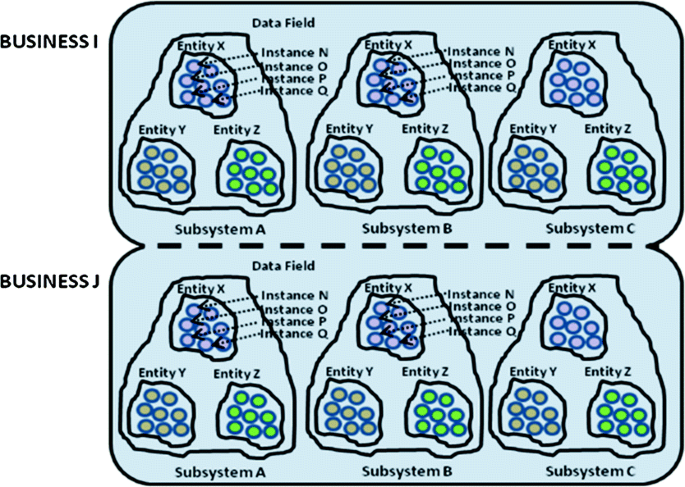

## Overview

The **ADSOA Calculator Project** is an implementation of the Autonomous Decentralized Service-Oriented Architecture (ADSOA) to create a system capable of handling arithmetic operations. The project is built to demonstrate the principles of distributed systems, fault tolerance, and service-oriented architecture, applying these to a simple yet robust calculator application.

{}
Applied Student Project for the Systems Analysis and Design Course
{}

**Objective**

The primary goal is to develop a robust, scalable, and autonomous architecture that handles basic arithmetic operations (addition, subtraction, multiplication, and division). The system should leverage distributed processing while ensuring high availability and low downtime.

---

**What is ADSOA?**

ADSOA combines two key architectural paradigms:

1. **Autonomous Decentralized Systems (ADS)**:
   - Focus on creating independent, self-contained components that can operate without relying on other parts of the system.
   - Resilience to faults: Even if one component fails, the rest of the system continues to function.

2. **Service-Oriented Architecture (SOA)**:
   - Emphasizes modularity and reusability through services that communicate via defined protocols.
   - Decouples components to promote scalability and maintainability.

**ADSOA** integrates these paradigms, resulting in a hybrid architecture that emphasizes modular, independent, and distributed components capable of handling failures gracefully. It mimics the human body system: independent yet interconnected subsystems working collectively.

<div class="text-center">



</div>

{}
<a href="https://link.springer.com/chapter/10.1007/978-3-030-33749-0_15" target="blank">Architecture Paper of ADSOA</a>
{}

---

### Key Concepts of ADSOA in the Calculator

1. **Data Field (DF)**:
   - Acts as the communication hub for the system.
   - Handles message transmission and ensures that only the relevant components process requests.

2. **Nodes**:
   - Base units of the architecture.
   - Responsible for relaying messages and connecting different system components.

3. **Cells**:
   - Functional units that provide specific services, such as performing arithmetic operations.
   - Operate independently, ensuring system scalability and reliability.


<div class="text-center">


</div>

---

### ADSOA Calculator System Design

The system consists of:
- **Client Interfaces**: Graphical User Interfaces (GUIs) for user interaction.
- **Service Cells**: Perform arithmetic operations (e.g., addition, subtraction).
- **Nodes**: Distribute and relay messages between clients and service cells.
- **Data Field (DF)**: The central communication layer, ensuring smooth data flow across components.

The system's design ensures high modularity, allowing new services or interfaces to be added without disrupting existing components.

<div class="text-center">


</div>

---

**Java Implementation**

The project leverages Java due to its robust support for multithreading, networking, and GUI development. The following technologies and techniques are used:

- **UI Frameworks**:
  - **JFoenix** and **FontAwesome** for an intuitive and interactive graphical interface.
- **Backend**:
  - **Threads** for handling concurrent operations.
  - **WebSockets** for seamless communication between components.
  - **Reflection** for dynamically handling arithmetic operations.
- **Instance Management**:
  - A specialized instance generator to create and manage service containers dynamically.

---

### ADSOA Protocol

The ADSOA protocol manages system communication and ensures fault tolerance:
1. **Node Registration**:
   - New nodes request permission to join the Data Field (DF).
   - DF validates and integrates the node into the network.
2. **Message Handling**:
   - Messages contain metadata (e.g., source, destination, action type).
   - Only relevant nodes or cells process specific messages, improving efficiency.
3. **Service Requests**:
   - Clients send requests to the DF.
   - DF forwards requests to appropriate service cells, which process and return results.

---

## Basic System Implementation 

- **Objective**: Implement the foundational ADSOA components, including nodes, data field, and basic GUI.
- **Features**:
  - Creation of service cells for addition, subtraction, multiplication, and division.
  - Development of a basic graphical interface for user interaction.
  - Establishment of communication protocols for nodes and cells.

**Challenges and Benefits**
- **Challenges**:
  - Ensuring seamless node communication and message distribution.
  - Managing dynamic addition and removal of components in real-time.
- **Benefits**:
  - Scalable architecture allowing the addition of new services.
  - Fault-tolerant design ensures minimal system disruption.

<div class="text-center">


</div>

## Evolution of the ADSOA Calculator

After successfully implementing the foundational architecture, the next development stage focused on optimizing system performance, increasing fault tolerance, and enabling dynamic scalability. This part describes the enhancements introduced to the ADSOA calculator, which elevate it from a basic prototype to a robust distributed system.

---

**Advanced Features Implemented**

1. **Message Queuing System**

To manage incoming and outgoing messages efficiently, a multi-level queuing mechanism was introduced. The system uses three queues to organize and prioritize messages:

- **Incoming Message Queue**:
  - Temporarily stores all received messages.
  - Ensures no messages are lost during high traffic periods.
  
- **Processing Queue**:
  - Processes messages based on their type and priority.
  - Handles service requests (e.g., arithmetic operations), acknowledgment messages (acuses), and status updates.

- **Outgoing Message Queue**:
  - Holds processed responses until they are sent back to the appropriate node, cell, or client.
  - Prevents duplicate messages by maintaining a record of completed processes.

<div class="text-center">


</div>

---

2. **Service Replication and Cloning**

To enhance system availability, the concept of **cloning service cells** was introduced. This mechanism ensures that critical services remain operational, even if individual cells fail.

- **How Cloning Works**:
  - A clone request is triggered when the system detects low availability of a service.
  - Service cells replicate themselves, inheriting all configurations from the original cell.
  - The replicated cells register themselves with the Data Field (DF) and become operational.

- **Cloning Protocol**:
  - Ensures that only one clone is created per service request to avoid resource wastage.
  - Uses timestamps and message coordination to prevent redundant cloning.

**Benefits**:
- Improved fault tolerance.
- Load balancing by distributing requests across multiple service cells.

<div class="text-center">


</div>

---

3. **Service Execution from Disk**

Originally, all services were embedded within the service cells. To make the system more modular and scalable, services were externalized and executed from disk.

- **Process**:
  - Service cells retrieve service scripts or executables from disk.
  - The script is loaded dynamically, executed with the required parameters, and results are returned.
  - The script or executable is destroyed after execution to free resources.

- **Advantages**:
  - Allows dynamic addition of new services without modifying the system code.
  - Reduces memory usage by only loading services when needed.

<div class="text-center">


</div>

**Example explanation**
1. Message Sent: A message is sent to the service cell specifying an operation (e.g., multiplication 2 x 3).
2. Message Received: The service cell receives the message and dynamically calls the requested operation using reflection.
3. Result Generated: The operation is executed, the result is calculated (6), and the reflection instance is cleared to free memory.
4. Result Sent: The calculated result (6) is sent back to the requester.

---

4. **Dynamic Configuration with Files**

Configuration files were introduced to provide flexibility in managing service cells:

- **Configuration File Format**:
  - Specifies the services available in each cell.
  - Uses a simple text-based format for ease of use.
  
  **Example**:
  ```
  # Configuration for Cell A
  Services:
  - Addition
  - Subtraction
  ```

- **Security Mechanism**:
  - Cells only execute services defined in their configuration file.
  - Ensures unauthorized modifications or additions are prevented.

<div class="text-center">


</div>

---

5. **Acknowledgment System (Acuses)**
The acknowledgment system ensures message delivery and tracks the completion of service requests.

- **Key Features**:
  - Each acknowledgment (acuse) includes a unique event ID for tracking.
  - Acuses are used to verify that a message has reached its destination and has been processed successfully.
  - Retransmissions are triggered if acknowledgments are not received within a specified timeframe.

- **Use Cases**:
  - Prevent message loss during network disruptions.
  - Identify and resolve failed service requests efficiently.


<div class="text-center">


</div>

---

### Protocol Enhancements

The communication protocol between nodes and cells was updated to support the new features:

**Updated Message Structure**
Messages now include additional metadata to handle dynamic configurations and cloning:

- **Header Section**:
  - **Content Code (CC)**: Indicates the type of message (e.g., service request, acknowledgment).
  - **Source Type (TS)**: Identifies whether the message originated from a node or a cell.
  - **Fingerprint ID (FID)**: Unique identifier for the originating entity.

- **Body Section**:
  - **Operation Code (OP)**: Specifies the operation to be performed.
  - **Values (VAL)**: Contains input data for the operation.
  - **Event ID (EVID)**: Tracks the specific event associated with the message.

**Message Processing Workflow**
1. **Message Reception**:
   - Messages are received by the DF and added to the incoming queue.
2. **Message Distribution**:
   - Messages are forwarded to the appropriate nodes or service cells based on the operation type.
3. **Service Execution**:
   - Service cells process the request and generate results.
4. **Response Delivery**:
   - Results are sent back to the client via the DF.

<div class="text-center">


</div>

---

### Improved Fault Tolerance

The enhancements introduced several mechanisms to improve the system's fault tolerance:

1. **Node Monitoring**:
   - Nodes continuously monitor each other for availability.
   - If a node fails, other nodes take over its responsibilities seamlessly.

2. **Service Redundancy**:
   - Multiple instances of the same service ensure continuous availability.
   - Load balancing algorithms distribute requests evenly across service cells.

3. **Message Duplication Prevention**:
   - Unique identifiers in message headers prevent duplicate processing.

---

**Advanced Graphical Interfaces**

The graphical user interfaces were redesigned to provide better usability and system visibility:

1. **Client Interface**:
   - Clean, user-friendly design for submitting arithmetic operations.
   - Displays results and logs of processed requests.

2. **Node Monitor**:
   - Visualizes the status of all active nodes and their connections.
   - Highlights failed nodes and provides recovery options.

3. **Service Cell Dashboard**:
   - Lists available services and their current status.
   - Displays real-time logs of processed messages.

4. **Cell Manager**:
   - Allows administrators to add, remove, or modify services dynamically.
   - Provides detailed reports on service usage and performance.

---

### Final Features Implemented 

1. **Dynamic DNA Injection**
This feature enables service cells to dynamically update their operational capabilities without requiring system downtime.

- **How it Works**:
  - A specialized **Cell Manager** sends "DNA injection" messages through the Data Field (DF).
  - Target cells receiving these messages add the specified services to their configurations dynamically.
  - DNA injection is validated to ensure that only authorized updates are applied.

- **Benefits**:
  - Facilitates quick deployment of new services.
  - Reduces system downtime by eliminating the need for manual updates.

<div class="text-center">


</div>

---

2. **Service Removal**
Just as services can be dynamically added, they can also be removed when no longer needed or to optimize performance.

- **How it Works**:
  - The Cell Manager sends service removal messages specifying the conditions for deletion.
  - Cells validate the conditions and remove the specified services accordingly.

- **Use Cases**:
  - Removing deprecated or outdated services.
  - Optimizing resources by deactivating underused features.

<div class="text-center">


</div>

---

3. **Mother Cell**
A "Mother Cell" was introduced as a central unit capable of replicating itself and acquiring any required service dynamically. This cell acts as a fallback mechanism to ensure system continuity.

- **Key Capabilities**:
  - The ability to adopt any service requested by the DF.
  - Automatic replication when system demand increases or redundancy is required.

- **Advantages**:
  - Acts as a backup for critical operations.
  - Improves system reliability during peak usage.

---

4. **Improved Instance Management**
A new **Instance Generator** was developed to manage the lifecycle of service cells and nodes more effectively.

- **Key Features**:
  - Dynamically instantiates service cells based on workload and service requests.
  - Tracks active instances and provides options to scale up or down as needed.

- **Technical Implementation**:
  - Java threads for efficient resource utilization.
  - WebSockets for seamless communication with the DF.

<div class="text-center">


</div>

---

**Advantages of the System**

1. **High Availability**:
   - With features like cloning, dynamic DNA injection, and Mother Cell capabilities, the system remains operational even under adverse conditions.

2. **Flexibility**:
   - Dynamic service addition and removal ensure the system can adapt to changing requirements.

3. **Fault Tolerance**:
   - Redundancy and monitoring mechanisms minimize the impact of node or cell failures.

4. **Scalability**:
   - The architecture supports the addition of unlimited nodes, cells, and clients, making it suitable for larger-scale deployments.

---

## Final Version

1. **Calculator Interface**:
   - User-friendly design for performing arithmetic operations.
   - Displays real-time results and operation logs.

<div class="text-center">


</div>


2. **Node Manager**:
   - Visual representation of all active nodes and their statuses.
   - Includes options to manually start, stop, or monitor nodes.

<div class="text-center">


</div>


3. **Cell Manager**:
   - Lists all operational cells and their available services.
   - Add and remove operations throught the parameters.

<div class="text-center">


</div>

4. **Instance Manager**:
   - Allows administrators to manage the lifecycle of service cells dynamically.
   - Includes tools for scaling and optimizing resource usage.

<div class="text-center">


</div>

### Demo video



---

## Future Directions and Enhancements

1. **Integration with Other Architectures**
The system can be integrated with cloud platforms for improved scalability and resilience. Technologies like Kubernetes could manage nodes and cells as containers.

2. **Advanced Service Capabilities**
The architecture can support more complex operations, such as:
- Matrix calculations.
- Statistical functions.
- Graph plotting.

3. **Security Enhancements**
Future iterations could include:
- Encryption for secure communication between nodes and cells.
- Authentication mechanisms to restrict unauthorized access.

4. **Cross-Platform Support**
While the current implementation uses Java, the system could be adapted to other programming languages or frameworks to increase flexibility.

---

## PDF Download Section

For a detailed explanation of the ADSOA Calculator Project, including diagrams, testing results, and implementation details, download the full PDF documentation here:

<a href="resources/Entrega final ADSOA.pdf" target="blank"> Download PDF Documentation</a>

---

## Conclusion

The ADSOA Calculator Project successfully demonstrates the potential of distributed architectures in building scalable and fault-tolerant systems. By combining the principles of ADS and SOA, this project lays the groundwork for more complex applications in critical environments. The final system not only performs arithmetic operations efficiently but also provides a robust framework for future enhancements and applications.
