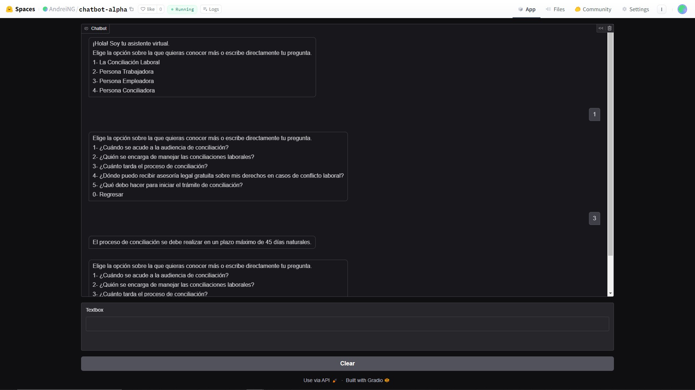
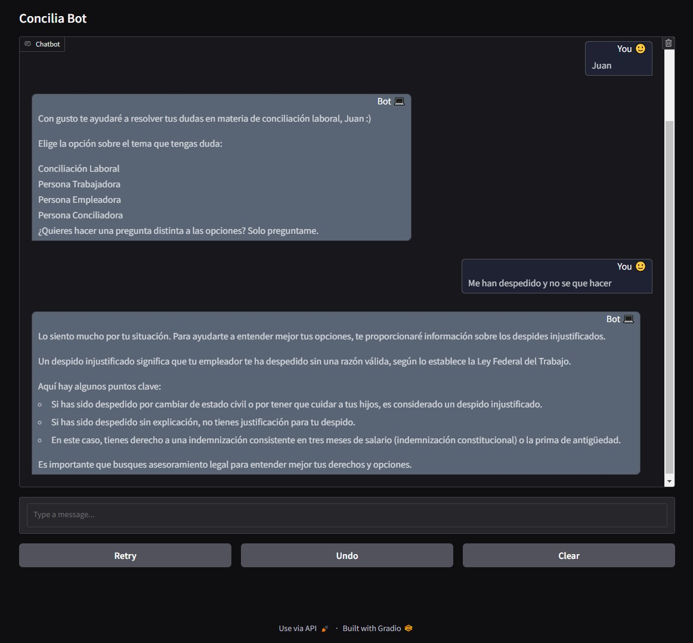

## Project Overview

This project showcases the development of a chatbot designed to assist users with labor-related queries, including conciliation processes, workers' rights, employer responsibilities, and conciliator training. It was developed in **two phases**:

1. **Phase 1**: A traditional chatbot utilizing cosine similarity for response generation and a static menu structure.
2. **Phase 2**: A sophisticated solution leveraging local large language models (LLMs), retrieval-augmented generation (RAG), and ChromaDB for advanced conversational capabilities.

### Objectives

- Create an intuitive and interactive chatbot for labor information.
- Compare traditional and modern chatbot development approaches.
- Demonstrate the practical use of local LLMs in a retrieval-augmented framework.

---

## Traditional Chatbot with Cosine Similarity

The first phase implements a chatbot using cosine similarity and a static menu-driven structure. The goal was to provide a foundational chatbot that could match user queries to predefined patterns using vector similarity.

### Key Features
- **Static Menu Navigation**:
  - Users navigate through predefined categories to select questions.
  - Categories include labor conciliation, workers' rights, employer responsibilities, and conciliator training.
  
- **Cosine Similarity Matching**:
  - SpaCy’s `es_core_news_sm` model processes and embeds query patterns as vectors.
  - User input is cleaned, embedded into a vector, and compared with the dataset using cosine similarity.
  
- **Threshold-Based Responses**:
  - Only patterns with similarity scores above a certain threshold are considered valid.
  - If no match is found, the user is notified to refine their query.

- **Gradio-Based Interface**:
  - A user-friendly browser interface facilitates chatbot interaction.
  - Includes options to clear conversation history and reset navigation.

### Technology Stack
- **Python Libraries**:
  - `nltk`, `spacy`, and `numpy` for natural language processing.
  - `pandas` for managing the dataset.
  - `Gradio` for the chatbot interface.

### Limitations
- **Rigid Structure**: The menu-driven navigation can be cumbersome for users.
- **Dependency on Predefined Patterns**: Matching accuracy depends on the completeness and quality of the dataset.
- **Limited Context Understanding**: The chatbot cannot handle conversational queries or multi-turn interactions effectively.

---

## Advanced Chatbot with Local LLMs and RAG

The second phase focuses on modernizing the chatbot by incorporating advanced NLP techniques, including retrieval-augmented generation (RAG) and locally deployed large language models (LLMs).

### Key Features
- **Local LLMs**:
  - Models `phi3.5` and `llama3.2` are deployed locally using **Ollama**.
  - Inference is performed using an **NVIDIA GTX 1070 GPU (8 GB VRAM)** for efficient local processing.
  
- **Retrieval-Augmented Generation (RAG)**:
  - Integrates ChromaDB to store and retrieve relevant knowledge based on user input.
  - Enhances the LLM’s ability to generate precise, contextually relevant responses.

- **ChromaDB Vector Store**:
  - Stores vector embeddings of labor-related data using `OllamaEmbeddings`.
  - Enables fast and accurate retrieval of context during queries.

- **LangChain Integration**:
  - Manages conversational chains with memory capabilities, ensuring the chatbot can handle multi-turn interactions.
  - Uses **ConversationBufferMemory** to maintain the flow of the conversation.

- **Prompt Engineering**:
  - Custom prompts enforce concise, professional, and contextually relevant responses.
  - The chatbot focuses on labor information and avoids irrelevant or ambiguous answers.

- **Gradio Interface**:
  - A modern, visually appealing user interface supports conversational interactions.
  - Dynamic features such as retry, undo, and clear enhance usability.

## Embedded Information for RAG

As part of the **RAG (Retrieval-Augmented Generation)** implementation, labor-related data was embedded into **ChromaDB** for efficient retrieval. Below are examples of the embedded information used in the chatbot:

<blockquote>
<h3>Category: La Conciliación Laboral</h3>
<b>Question:</b> ¿Dónde puedo recibir asesoría legal gratuita sobre mis derechos en casos de conflicto laboral?
<b>Answer:</b> Las conciliaciones locales deben brindar asesoría legal gratuita a quienes busquen orientación sobre sus derechos en casos de conflicto laboral. Para comenzar tu trámite, acércate a tu Centro de Conciliación para que te expliquen a detalle y presenta la solicitud.  
<b>Question:</b> ¿Cuándo se acude a la audiencia de conciliación?
<b>Answer:</b> La Reforma Laboral exige que trabajadores y empleadores acudan a una audiencia de conciliación antes de iniciar algún juicio ante los Tribunales Laborales. La conciliación se hace antes de ir a juicio; es un proceso gratuito, imparcial, y confidencial.  
<b>Question:</b> ¿Qué debo hacer para iniciar el trámite de conciliación?
<b>Answer:</b> Las conciliaciones locales ...
</blockquote>

### Technology Stack
- **Python Libraries**:
  - `langchain` for chain management and memory handling.
  - `Chroma` for vector storage and retrieval.
  - `OllamaEmbeddings` for creating vector embeddings.
  - `Gradio` for the chatbot interface.

### Advantages
- **Context-Aware Responses**: The chatbot dynamically retrieves relevant context and generates accurate responses.
- **Scalability**: New knowledge can be easily added to the vector store.
- **Sophistication**: The chatbot adapts to complex queries and handles multi-turn conversations.

---

## Comparison

| Feature                     | Cosine Similarity      | Advanced LLM with RAG |
|-----------------------------|----------------------------------|---------------------------------|
| **Architecture**            | Traditional menu-driven design  | Modern retrieval-augmented model |
| **Response Generation**     | Cosine similarity-based matching | Contextual generation using LLMs |
| **Technology**              | Static embeddings with SpaCy    | Dynamic embeddings with ChromaDB |
| **Interface**               | Basic Gradio interface          | Advanced Gradio with memory and controls |
| **Scalability**             | Limited to predefined patterns   | Easily scalable with new data and context |
| **Flexibility**             | Rigid navigation and responses  | Dynamic, context-aware interaction |
| **Hardware Requirements**   | Minimal (CPU)                   | GPU for LLM inference |

---

## Results and Insights

1. **Cosine Similarity**:
   - Provides a simple, lightweight chatbot with basic functionality.
   - Suitable for straightforward applications with predefined datasets.

2. **Advanced LLM with RAG**:
   - Offers a sophisticated, context-aware chatbot capable of handling complex queries.
   - Suitable for advance applications with user friendly experience.

---

## Conclusion

This project demonstrates the evolution of chatbot technology, highlighting the shift from traditional static methods to advanced conversational AI using local LLMs and RAG. The comparison between the two phases illustrates the benefits and trade-offs of each approach, providing a blueprint for future chatbot development in labor information and other domains.