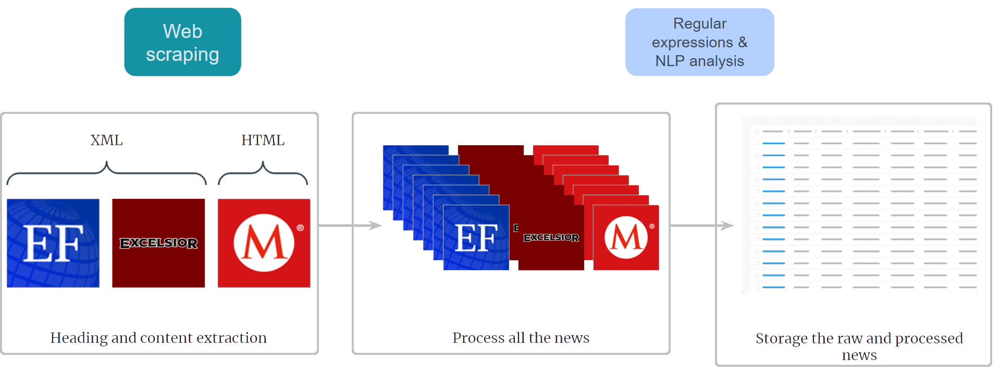
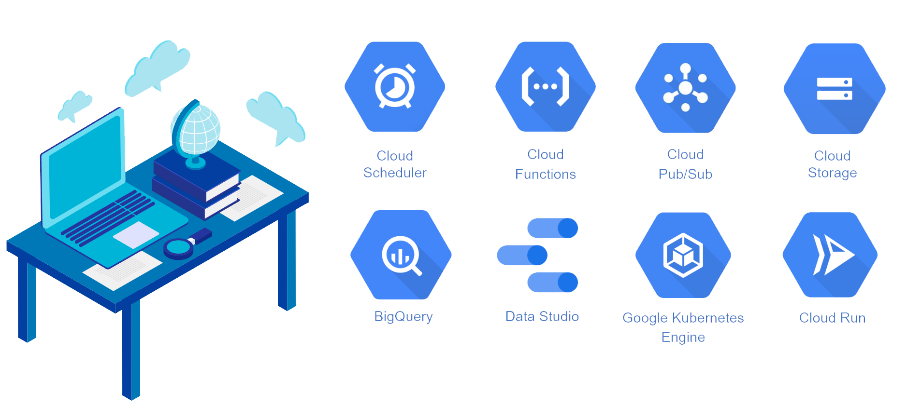
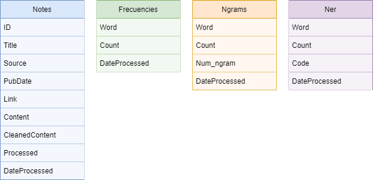
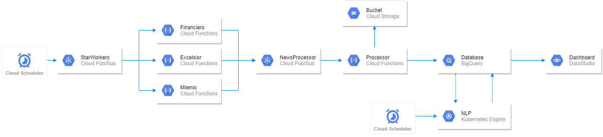
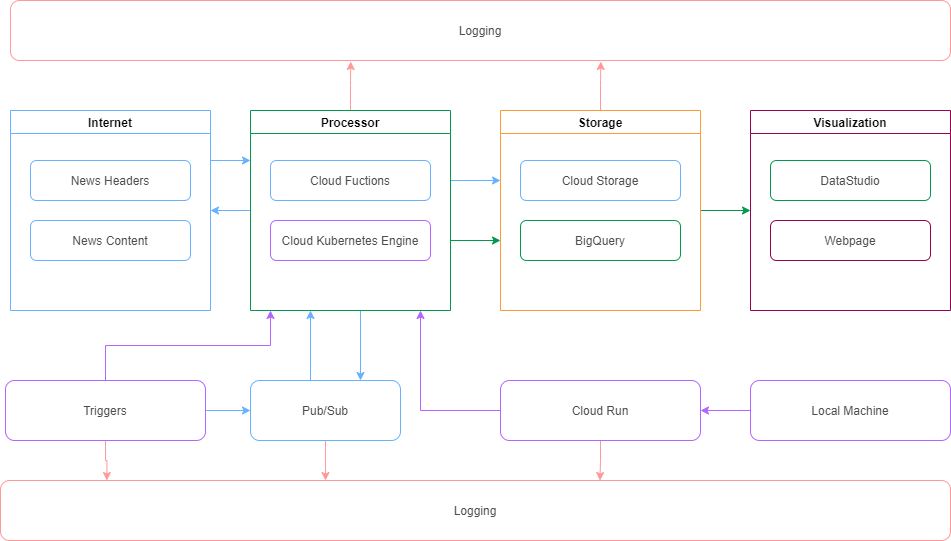

## Project Overview

This project, developed as a part of the "Cloud Computing" course in the Master's in Data Science program, demonstrates an automated news analysis system using various Google Cloud Platform (GCP) services. The objective was to create a scalable, serverless solution for extracting, processing, and analyzing news articles from popular media outlets.

### Goals
1. Implement a cloud-based solution for a real-world problem.
2. Develop a data science project deployable on the cloud.
3. Utilize Google Cloud Platform tools to streamline the process.
4. Propose an innovative solution that could benefit companies needing media monitoring.

### Business Use Case
Many organizations rely on press monitoring services to track relevant news about their sector, evaluate brand presence, and adjust communication strategies. Despite the availability of electronic solutions, many still depend on manual methods, leading to time and resource inefficiencies.

### Solution Requirements
The solution needed to:
- Extract HTML and XML files from news sites.
- Automate processes using Google Cloud Platform.
- Perform text extraction, cleaning, and storage in a structured database.
- Implement Natural Language Processing (NLP) techniques to identify and analyze key entities.
- Visualize the insights on a user-friendly dashboard.

---

## GCP Tools Utilized

- **Cloud Scheduler**: Schedules tasks to initiate news extraction twice daily.
- **Cloud Functions**: Runs serverless code to extract headlines, publish dates, links, and full text.
- **Cloud Pub/Sub**: Manages messaging between services, ensuring that extracted data flows smoothly through each stage.
- **Cloud Storage**: Stores the raw HTML content for historical and backup purposes.
- **BigQuery**: Acts as the structured data warehouse for processed news data.
- **Data Studio**: Creates an interactive dashboard for visualizing analysis results.
- **Google Kubernetes Engine (GKE)**: Runs NLP models for entity recognition and text analysis. 
  - **Docker**:  Used to containerize the application, ensuring consistency and portability.
- **Cloud Run**: Deploys serverless containers for additional NLP tasks.
- **Cloud Logging**: Monitors service performance and logs events for troubleshooting.

---

## Data Science Workflow

The data science model focuses on processing raw news text to identify essential information. Key techniques include:
- **Tokenization and Normalization**: Prepares text for analysis.
- **Frequency Analysis**: Highlights recurring terms.
- **N-grams Analysis**: Uses unigrams, bigrams, trigrams, and quadrigrams for text insights with NLTK.
- **Named Entity Recognition (NER)**: Identifies named entities such as people, places, and organizations using spaCy.

The results of these analyses are stored in BigQuery for structured, queryable storage, and later visualized in Data Studio.

---

## Data Schema

### Key Tables

1. **Notes Table**: Stores metadata and processed content for each news article.
2. **Frequency Table**: Tracks the frequency of each word in the processed content.
3. **N-grams Table**: Stores n-gram counts for further analysis.
4. **NER Table**: Contains recognized entities (e.g., persons, places, organizations) with occurrence counts.

---

## Architecture and Workflow

The system architecture is designed to be fully decoupled, serverless, and scalable. The core workflows are:

### Workflow 1: News Extraction
1. Cloud Scheduler triggers news extraction at specific intervals.
2. Cloud Functions extract key details (title, date, link) from each news source.
3. Extracted data is preprocessed and stored in Cloud Storage and BigQuery.

### Workflow 2: News Analysis
1. Cloud Scheduler triggers NLP analysis at scheduled times.
2. The NLP model processes each article, performing frequency analysis and entity recognition.
3. The results are stored in BigQuery and visualized in Data Studio.

### Architecture Diagram
The architecture includes Cloud Functions for individual tasks, Pub/Sub for message passing, BigQuery for data storage, and Data Studio for the dashboard, enabling easy monitoring and analysis.

---

## Dashboard

A Data Studio dashboard was set up to present the analysis results. Key features include:
- **Page 1**: Overview of collected news with filters by source, date, and keywords.
- **Page 2**: Word frequency and n-grams analysis.
- **Page 3**: Advanced n-grams and word cloud visualizations.
- **Page 4**: Named Entity Recognition (NER) analysis, including breakdowns by persons, places, and organizations.

### PDF Example Report

<a href="resources/Report_Dashboard.pdf" target="blank"> Dashboard Report PDF</a>

---

## Conclusion

This cloud-based solution for news analysis offers:
- **Speed**: Efficiently automates tasks with minimal latency.
- **Reliability**: Scheduled jobs ensure consistent performance.
- **Cost-Effectiveness**: Serverless infrastructure reduces costs.
- **Usability**: Provides actionable insights through data-driven visualizations.

### Future Improvements
- Integrating additional media sources for broader coverage.
- Expanding the NLP model to analyze more variables.
- Enhancing indexing and database relationships for richer analysis.

### Colaborations

This project is a colaboration with Miguel Ángel Bernal