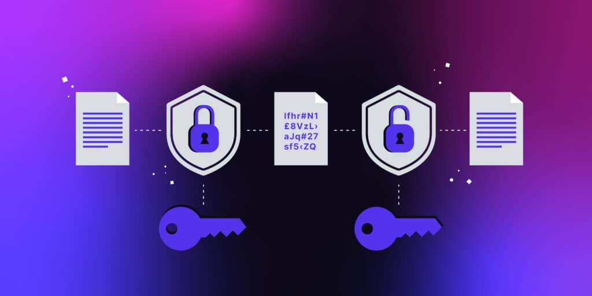
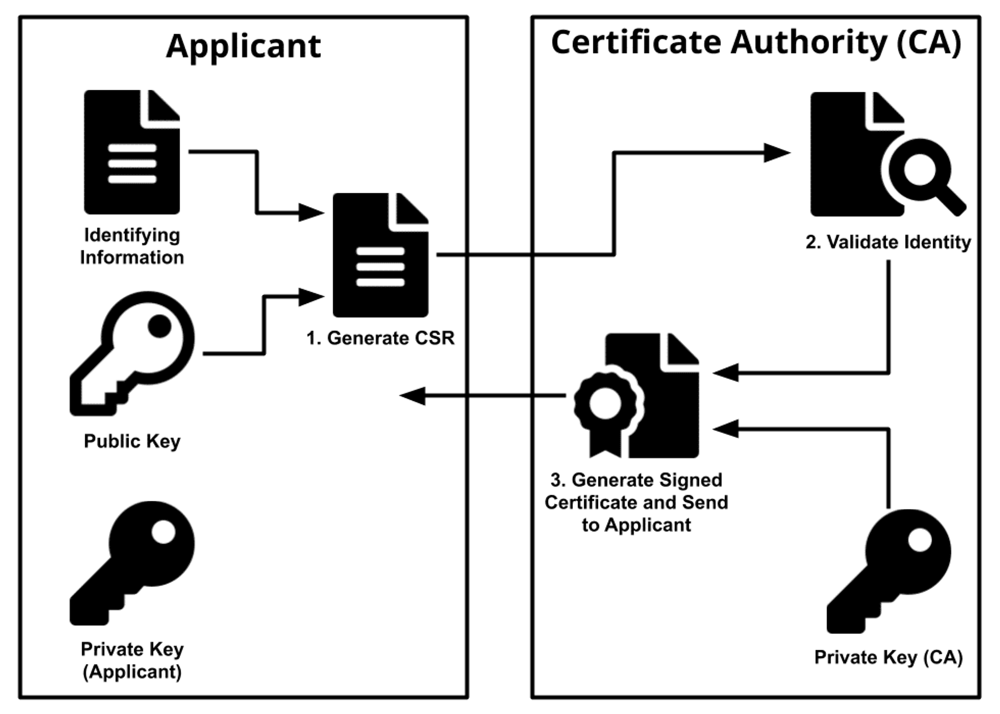
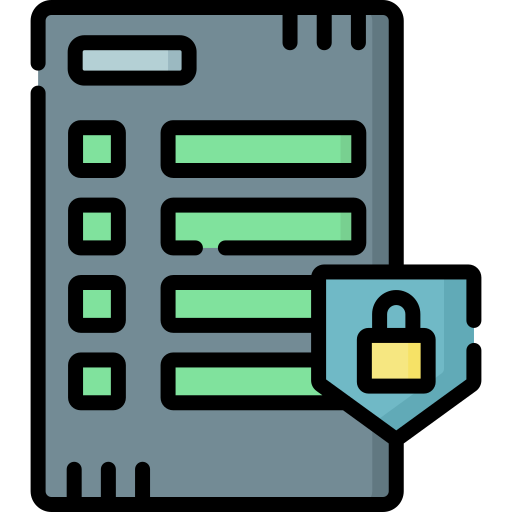
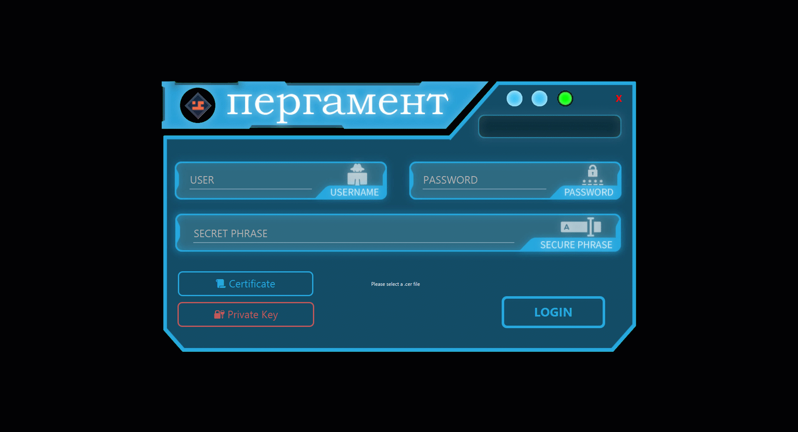

## Project Overview

The **Secure Chat Application** is an advanced messaging system built in Java, designed to demonstrate the practical application of cryptographic techniques in ensuring secure communication. The project includes a client-server architecture, a Public Key Infrastructure (PKI) for certificate and key management, and multiple encryption methods for message confidentiality, integrity, and authenticity.

---

### Goals

- Enable secure communication between users.
- Implement cryptographic protocols to safeguard messages.
- Develop a comprehensive PKI for managing public keys and digital certificates.

---

## Key Features of the Secure Chat Application

1. Cryptographic Techniques
The project implements the following encryption methods:

- **Plaintext Messages**:
  - Messages sent without any encryption (for demonstration purposes only).
  
- **Symmetric Encryption**:
  - Utilizes a shared secret key to encrypt and decrypt messages.
  - Keys are exchanged securely using the PKI.

- **Asymmetric Encryption**:
  - Messages are encrypted with the sender's private key and decrypted using the recipient's public key.

- **Digital Signatures**:
  - Ensures message authenticity and integrity by hashing the message and encrypting the hash with the sender's private key.

- **Digital Envelopes**:
  - Combines symmetric encryption for message content and asymmetric encryption for the symmetric key.

---

2. Public Key Infrastructure (PKI)
The PKI acts as the backbone for managing cryptographic keys and certificates. It includes:

- **Certificate Authority (CA)**:
  - Issues and manages digital certificates.
  - Associates public keys with user identities.

- **Key Management**:
  - Stores and updates public/private key pairs.
  - Facilitates secure key exchanges between users.

---

3. Client Application
The client application supports the following features:

- **User Registration**:
  - Registers user information along with their public/private key pairs.
  - Generates digital certificates for authentication.

- **Messaging**:
  - Sends and receives messages with options to select encryption levels.
  - Validates digital signatures and decrypts messages using appropriate methods.

- **Contact Management**:
  - Allows users to add and manage contacts securely.

- **Session Initialization**:
  - Uses a secure authentication protocol with two-factor authentication.

---

4. Server Component
The central server manages client connections and facilitates secure communication. Its responsibilities include:

- Storing and forwarding messages.
- Maintaining user data and certificates.
- Interfacing with the PKI for key retrieval and validation.

---

## Implementation Details

### Technologies Used
- **Programming Language**: Java.
- **Networking**: Sockets and threads for client-server communication.
- **Database**: Embedded databases for storing user credentials, messages, and certificates.

### Protocols and Security Mechanisms
1. **Authentication Protocol (PFS)**:
   - Ensures secure user authentication with two factors.
   - Prevents unauthorized access to the system.

2. **Message Structure**:
   Each message is an object containing:
   - Content code (indicates the type of service).
   - Sender and receiver identifiers.
   - Message content (encrypted or plain).
   - Event ID for tracking and validation.

---

## Cryptography in Action

1. **Key Exchange**
- Public/private key pairs are generated during user registration.
- Keys are securely shared using the PKI.

2. **Message Encryption**
- *Symmetric Encryption*: Fast and efficient for large messages.
- *Asymmetric Encryption*: Adds security for key exchange and digital signatures.

3. **Digital Signatures**
- Ensures that the sender is authenticated.
- Detects any tampering with the message content.

4. **Digital Envelopes**
- Combines the speed of symmetric encryption with the security of asymmetric encryption.

## Components of the Final Secure Chat Application

The final implementation of the **Secure Chat Application** integrates multiple components to deliver a robust, secure, and user-friendly messaging platform. Each element has been meticulously designed to ensure seamless operation, advanced security, and intuitive usability.

---

1. **Login Interface**
   - **Purpose**:
     - Provides secure access to the chat application.
     - Implements multi-factor authentication (MFA) for enhanced security.
   - **Features**:
     - **Username and Password**: Basic credentials for user authentication.
     - **Secret Phrase**: Adds an extra layer of security, unique to each user.
     - **Certificate Upload**: Users must upload their `.cer` file to verify their identity through the Public Key Infrastructure (PKI).
     - **Private Key Integration**: Ensures user authenticity by validating the private key.
     - **Automated Transition to Chat UI**: Upon successful authentication, the login interface seamlessly transitions to the **Chat UI**, granting users access to secure messaging.

---

2. **Public Key Infrastructure (PKI) Status Panel**
   - **Purpose**:
     - Acts as the backend certificate authority, managing cryptographic keys and certificates.
   - **Features**:
     - **Real-Time System Feedback**:
       - Displays the current status of the database connection and other critical operations.
       - Logs activities such as database creation, connection establishment, and certificate updates.
     - **Certificate and Key Management**:
       - Handles the storage, creation, and retrieval of public/private key pairs and certificates.
       - Ensures secure communication between all entities in the system.

---

3. **User Registration Interface**
   - **Purpose**:
     - Allows new users to securely register with the chat system.
   - **Features**:
     - **User Number**: A unique identifier for each user.
     - **Username and Password**: Standard authentication credentials.
     - **Secure Phrase**: Enhances security by encrypting the user’s private key.
     - **Certificate Generation**:
       - Automatically generates public/private key pairs and issues a digital certificate upon registration.
     - **Validation**:
       - Prevents duplicate user numbers and enforces unique credentials.

---

4. **Chat UI**
   - **Purpose**:
     - The primary interface for sending and receiving secure messages.
   - **Features**:
     - **Encrypted Messaging**:
       - Supports multiple encryption levels: plaintext, symmetric, asymmetric, digital signatures, and digital envelopes.
     - **Contact Management**:
       - Enables users to add, remove, and manage their contacts securely.
     - **Message History**:
       - Stores encrypted message logs for future reference.
     - **Real-Time Interaction**:
       - Facilitates instant message exchange through efficient networking and PKI-based validation.
   - **Dynamic Launch**:
     - Automatically opens upon successful login, ensuring a smooth user experience.

---

## System Advantages

- **Security**:
  - Messages are encrypted end-to-end.
  - PKI ensures authenticity and prevents key spoofing.
  
- **Flexibility**:
  - Users can select the desired encryption level for each message.

- **Scalability**:
  - Designed to support multiple clients and secure message exchanges simultaneously.

---

## Conclusion

The **Secure Chat Application** demonstrates the effective use of cryptographic principles in modern communication systems. By combining client-server architecture with advanced cryptographic techniques and a robust PKI, the project highlights the importance of encryption in protecting sensitive information. This application serves as a foundation for building even more secure and scalable messaging systems.
