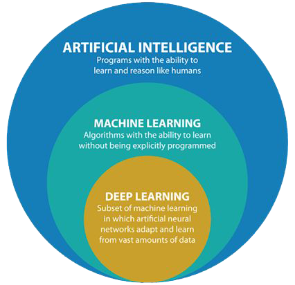

## Project Overview

This project, developed as part of the "Principles of Deep Learning" course in the Master's in Data Science program, focused on building a speech generator using deep learning techniques, specifically transformers. The model was fine-tuned with presidential speeches and related materials to produce coherent text outputs.

### Goals
1. Validate knowledge acquired in the course by applying deep learning techniques to solve a real-world problem.
2. Use publicly available material to generate new text information.
3. Train a deep learning model to generate speeches based on input text.

### Main Objective
To develop a deep learning model capable of generating speeches, trained on datasets including speeches from former Mexican presidents Felipe Calderón and Enrique Peña Nieto, and official press releases from presidential events.

---

## Theoretical Framework

### Deep Learning
Deep learning is a subset of machine learning that utilizes neural networks with multiple layers to simulate human brain behavior. These networks are designed to process and analyze large datasets, enabling predictions and classifications.

<div class="text-center">



</div>

### Transformers
Transformers are neural network architectures that excel in sequence-to-sequence tasks, such as language translation, text generation, and speech-to-text transformation. Unlike recurrent neural networks (RNNs), transformers leverage self-attention mechanisms to identify contextual relationships between words, allowing for faster and more parallelizable computations.

<div class="text-center">


</div>

---

## Business Case

Natural Language Processing (NLP) is integral to Artificial Intelligence (AI), enabling machines to work with unstructured text data. Text generation, a challenging NLP application, has widespread utility in customer service (chatbots) and journalism (automated reporting). This project aimed to leverage transformers to create a tool capable of generating coherent speeches in Spanish, tailored to the dataset's context.

---

## Data Collection

The dataset comprised 8,454 speech documents extracted from:
- **Official Mexican Government Sites**: Speeches and press releases from the presidency's archives.
- **Wayback Machine**: Archived speeches from previous administrations.

The extraction process utilized Python libraries such as `BeautifulSoup` and `requests` to scrape and preprocess the data, which was stored as text files for model training.

---

## Methodology

The project followed the CRISP-DM methodology, consisting of:

1. **Business Understanding**: Researching existing text-generation methods and identifying use cases.
2. **Data Understanding**: Extracting and verifying speeches for training.
3. **Data Preparation**: Creating a corpus, tokenizing text, and building frequency dictionaries.
4. **Modeling**: Evaluating deep learning frameworks (`PyTorch`, `TensorFlow`) and using pretrained transformer models.
5. **Evaluation**: Measuring model performance using metrics like loss and manual inspection of generated text.

<div class="text-center">


</div>

---

## Models Implemented

### Model 1: PyTorch
- **Framework**: PyTorch
- **Pretrained Model**: Roberta
- **Result**: Low loss but incoherent text generation.

### Model 2: TensorFlow
- **Framework**: TensorFlow
- **Pretrained Model**: AutoModel
- **Result**: Improved coherence but repetitive text.

### Model 3: GPT-2 Fine-tuned
- **Framework**: TensorFlow
- **Configuration**: Medium GPT-2 model, fine-tuned with 1,000 epochs.
- **Result**: Most coherent and contextually relevant text outputs, though some results deviated from the input topic.

---

## Final Model Configuration

**Model 3: GPT-2 Fine-tuned**

```python
gpt2.finetune(sess,
    dataset="input.txt",
    model_name='355M',
    steps=1000,
    restore_from='fresh',
    run_name='run1',
    print_every=50,
    sample_every=200,
    save_every=500
)
```

## Playground

**Discursero Web Application**

The **Discurselo** playground provides an interactive interface for generating speeches using artificial intelligence. Users can customize various parameters to create tailored and coherent texts based on their specific needs.

### Features

1. **Input Field**:
   - Users can enter a phrase or sentence to prompt the AI for speech generation.
   - Example prompt: *"México necesita apoyo de..."*

2. **Output Display**:
   - The generated speech is displayed in the output box, showing the result based on the input and configuration.

3. **Customizable Settings**:
   - **Number of Characters**: Adjust the length of the generated speech.
   - **Temperature**: Set the creativity of the text generation. A lower temperature produces deterministic results, while a higher value increases randomness and variability.
   - **Number of Speeches**: Generate multiple outputs for comparison and selection.

4. **Action Button**:
   - A single button (*"Generar Discurso"*) triggers the generation process, making it simple and intuitive for users.

<div class="text-center">


</div>

### Sample Outputs

1. **Prompt**: "El grave problema de inseguridad de México es"
<blockquote>
 Generated Text: <hr class="m-0-imp"> 
"El grave problema de inseguridad de México es claramente construir un México de leyes y de instituciones de seguridad.<br><br>
Por supuesto, quisiera señalar que en la materia, no sólo eso, sino que a nivel nacional, por cierto, desde la especie de la democracia y de la voluntad política, de la libertad, de la democracia y de instituciones democráticas, puede ser una de las mejores, una de las medidas que hoy realizan, una de las mejores plataformas para que sea la mayor responsabilidad de la sociedad.<br><br>
Asimismo, así como el hecho de que se han venido impulsando una mayor desarrollo en las instituciones de seguridad pública y de justicia, eso es lo que enfrentamos.<br><br>
Muchas gracias.
"
</blockquote>
   
   > 

2. **Prompt**: "El compromiso del Estado Mexicano con las mujeres del país"
<blockquote>
 Generated Text: <hr class="m-0-imp"> 
"El compromiso del Estado Mexicano con las mujeres del país, es posible dar un gran camino para abrir a la gente la oportunidad de bienestar y el progreso de todas en el país.<br><br>
Segundo. El México que se encuentra con la búsqueda de las niñas, los niños y los jóvenes, es un México de desarrollo social y de bienestar para todos.<br><br>
Tercero. El México que encabeza por el que presenciamos el mes de julio de 2017, aprovechamos el esfuerzo de todos los niveles de Gobierno para contribuir a la construcción de una gente abierta.<br><br>
Cuarto. El México que encabeza por el que encabeza el Presidente Enrique Peña Nieto, a través de los precios de generar los apoyos a los nuevos derechos fundamentales de los derechos humanos.<br><br>
Hoy, se encuentra con la búsqueda de la gente, pues llegamos a los nuevos derechos fundamentales, y sigue siendo mejor."
</blockquote>

---

## Conclusion

The project demonstrated the potential of deep learning for text generation tasks. Key findings include:
- Pretrained models save significant time and resources for training.
- Model coherence can be improved by narrowing training datasets to specific topics.
- Fine-tuning large-scale models like GPT-2 produces the best results but requires significant computational power.

### Future Work
1. Increase training epochs for better performance.
2. Create topic-specific models to improve contextual relevance.
3. Experiment with multilingual datasets for broader applicability.

### Colaborations

This project is a colaboration with Miguel Ángel Bernal