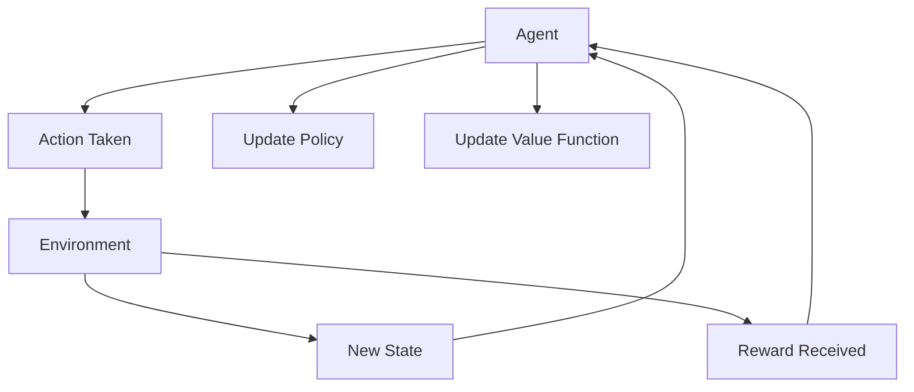
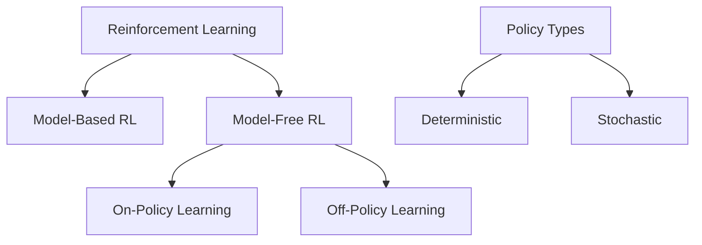
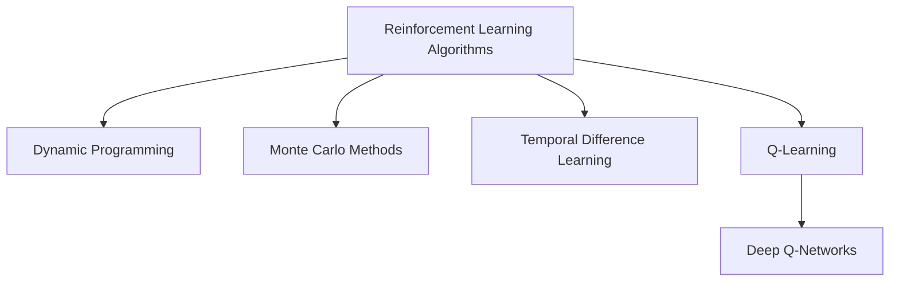
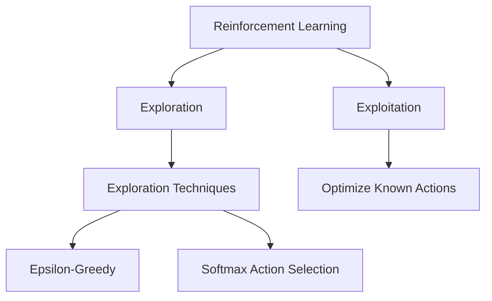
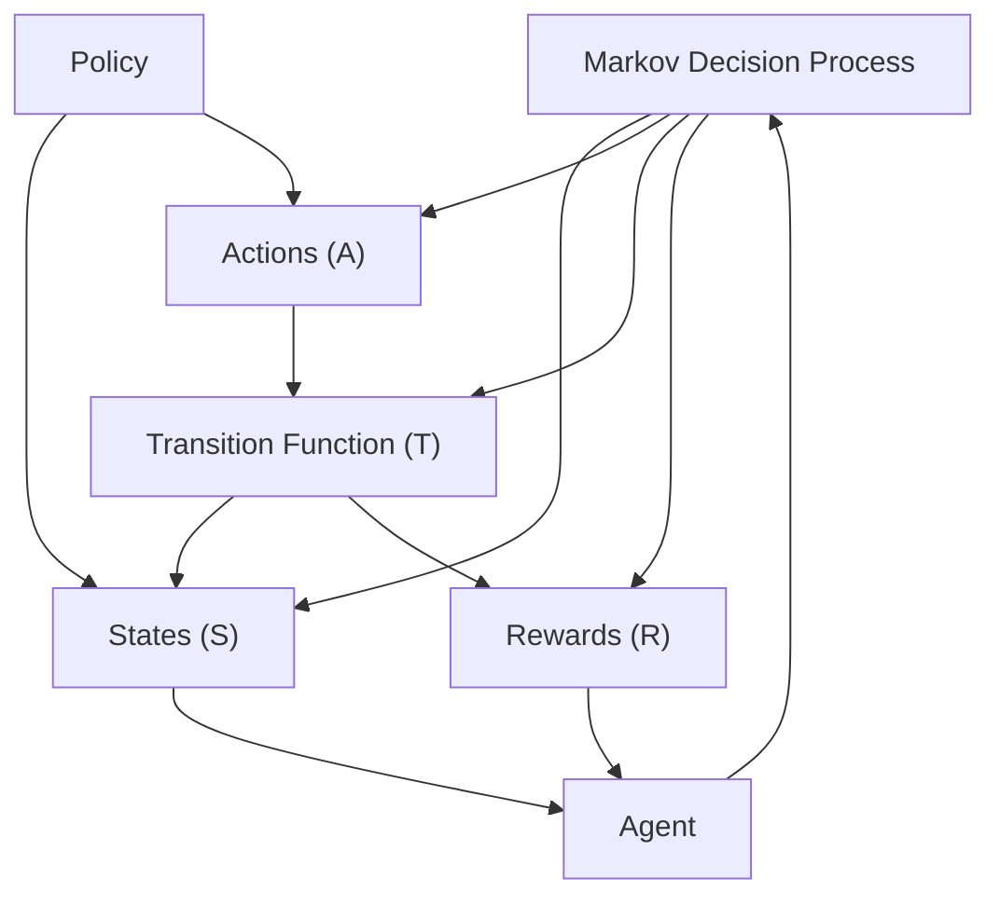

## 🚀 Overview 
Reinforcement Learning (RL) is a type of machine learning focused on training agents to make sequences of decisions by maximizing rewards in an environment. This tutorial will introduce you to the fundamental concepts, algorithms, and practical applications of RL.

## 📘 Introduction to Reinforcement Learning 

### What is Reinforcement Learning?
Reinforcement Learning (RL) is a type of machine learning where an agent learns to make decisions by interacting with an environment, aiming to maximize a cumulative reward over time. Unlike supervised learning, which learns from labeled data, RL learns from feedback (rewards or penalties) received after taking actions.

> Think of RL like training a dog with treats: if it performs a desired behavior, it gets rewarded; otherwise, it receives no treat. The dog (agent) learns over time to associate certain actions with positive outcomes, just like an RL model learns to maximize its rewards.

### Why is RL Important?
RL is crucial in scenarios where sequential decision-making is needed and has brought groundbreaking advancements in fields such as:
- **Gaming** (e.g., AlphaGo and Dota 2)
- **Robotics** (e.g., teaching robots to walk)
- **Finance** (e.g., optimizing trading strategies)
- **Healthcare** (e.g., personalized treatment plans)

These applications highlight the strength of RL in handling complex, dynamic environments where traditional methods may fall short.

### RL vs. Supervised & Unsupervised Learning
Here's a quick comparison to clarify the unique nature of RL:

| **Learning Type**      | **Example**                          | **Data**                          | **Goal**                       |
|------------------------|--------------------------------------|-----------------------------------|--------------------------------|
| Supervised Learning    | Image Classification                 | Labeled                            | Minimize error on predictions  |
| Unsupervised Learning  | Clustering Customer Data            | Unlabeled                          | Discover hidden patterns       |
| Reinforcement Learning | Training an Agent to Play a Game    | Reward feedback                    | Maximize cumulative reward     |

---

## 🛠️ Core Components 

Reinforcement Learning revolves around a few key components that work together to guide the agent’s learning process. Understanding these elements is essential to grasp how RL models make decisions and adapt over time. Here’s a closer look at each component:

1. **Agent** 🧑‍💻

   The **agent** is the learner or decision-maker in RL. It interacts with the environment, making decisions based on the information it receives, with the goal of maximizing rewards. For example, in a game, the agent might be a virtual character learning to navigate a maze.

2. **Environment** 🌍

   The **environment** represents everything external to the agent. It provides states and responds to the agent’s actions with new states and rewards. Think of the environment as the “world” where the agent operates, such as the maze in which the character moves.

3. **State** 📏

   The **state** is a snapshot of the environment at a specific time. It contains information that the agent uses to make decisions. For instance, a robot’s state might include its location, speed, and nearby obstacles. The agent continuously updates its state based on feedback from the environment.

4. **Actions** 🎮

   **Actions** are the choices available to the agent. Based on the current state, the agent selects an action to take in the environment. For example, in a maze game, actions could be moving left, right, up, or down. The set of possible actions can vary depending on the agent’s current state and the rules of the environment.

5. **Reward** 🏆

   **Rewards** are feedback signals given to the agent after each action. Positive rewards encourage actions that are beneficial, while negative rewards discourage undesirable actions. The goal of the agent is to maximize its cumulative reward over time. For example, reaching the end of a maze might provide a high reward, while hitting a wall might result in a penalty.

6. **Policy** 📋

   The **policy** defines the agent's strategy for selecting actions. It’s essentially a mapping from states to actions, dictating what the agent should do at each step. Policies can be simple (like a table of actions) or complex (like a neural network). A well-learned policy maximizes the agent's expected reward over time.

{}
   **Tip:** Policies are the backbone of the agent’s learning process. In RL, the objective is often to improve the policy based on experiences, making it increasingly effective in guiding the agent’s decisions.
{}

7. **Value Function** 📈

   The **value function** estimates the long-term reward of being in a particular state or of taking a specific action from that state. Unlike the immediate reward, the value function helps the agent anticipate future rewards, guiding it toward actions with potentially higher cumulative rewards. This distinction between short-term rewards and long-term value is crucial in complex environments.

{}
 **Insight:** Think of the value function as the agent’s intuition about what might pay off in the long run. For example, the agent may learn that moving away from the immediate goal may still yield a higher value if it leads to a better position in the future.
{}

8. **Model** (Optional) 🔄

   Some RL approaches use a **model** to predict the environment's response to the agent's actions. This can be beneficial in complex environments, where simulating outcomes helps the agent learn faster. However, many RL algorithms are model-free, meaning they don’t rely on predictions but instead learn solely from experience.

   > 🛠️ **Example:** A model could predict the next state or expected reward, allowing the agent to plan its actions more effectively. Model-based RL is especially useful when actions are costly or limited.

 

**Reinforcement Learning Process Flow:**

> This flowchart illustrates the key steps in the reinforcement learning process. The Agent interacts with the Environment by taking an Action, leading to a New State and receiving Reward feedback. The agent uses this information to Update Policy and Update Value Function, gradually improving its strategy to maximize cumulative rewards.

## 🧠 Types of Reinforcement Learning 

Reinforcement Learning approaches vary based on how the agent learns, whether it uses a model of the environment, and its strategy for selecting actions. Here are some of the key types:

1. **Model-Free vs. Model-Based RL**

   - **Model-Based RL**: The agent builds or uses a model to predict the environment's dynamics. This model helps simulate possible future states, allowing the agent to plan and evaluate actions before taking them. Model-based RL can be beneficial in environments where actions are expensive or where simulation provides efficient learning.

     > **Example**: In a self-driving car simulation, the model predicts the car's behavior under various conditions (e.g., speed, traffic). This prediction helps the agent make safer and more efficient decisions.

   - **Model-Free RL**: The agent learns through trial and error without an internal model of the environment. Instead, it relies on direct feedback from the environment (rewards and states) to improve. Model-free RL is simpler but requires more interactions with the environment.

     > **Example**: A robot learning to walk through trial and error in a real environment, adjusting actions solely based on received rewards.

2. **On-Policy vs. Off-Policy Learning**

   - **On-Policy Learning**: In on-policy learning, the agent learns from actions it takes according to its current policy. This approach focuses on improving the policy it follows during training. A common on-policy algorithm is **SARSA (State-Action-Reward-State-Action)**, which evaluates actions by considering both current and future policies.

{}
   **Note**: On-policy methods may be more stable but are sometimes slower in complex environments since the agent sticks to its current strategy while learning.
{}

   - **Off-Policy Learning**: In off-policy learning, the agent learns from actions that may differ from its current policy. This approach is useful because it allows the agent to explore a broader set of actions. **Q-Learning** is a popular off-policy algorithm that optimizes the agent's decisions independently from the current policy.

     > **Example**: In training simulations, an off-policy agent might observe the results of random actions taken by other agents, using that data to improve its policy.

3. **Deterministic vs. Stochastic Policies**

   - **Deterministic Policies**: These policies map a specific state to a single action. For example, if a robot’s state is "obstacle detected," its deterministic policy might dictate the action "turn left" every time. Deterministic policies can be effective in stable environments but are limited in flexibility.

   - **Stochastic Policies**: Stochastic policies assign probabilities to different actions in a given state, allowing a variety of actions instead of a single response. These policies are useful when exploration is necessary or when some randomness improves the agent’s ability to learn.

     > **Example**: In a game, an agent might decide to attack with a 70% probability and defend with a 30% probability based on its state, adding flexibility to its strategy.

 

**Summary:**

---

## 🗂️ Key Algorithms 

Reinforcement Learning relies on a range of algorithms that enable agents to learn from their experiences. Here are some of the most important foundational algorithms:

1. **Dynamic Programming (DP)**

   Dynamic Programming is a family of algorithms that solve problems by breaking them down into subproblems, solving each one only once, and storing the solutions. In RL, DP is used to compute optimal policies and value functions when the environment’s model is fully known.

   - **Policy Iteration**: This DP approach involves two main steps:
      1. **Policy Evaluation**: Calculates the value of each state under a given policy.
      2. **Policy Improvement**: Updates the policy based on the computed values, iterating until an optimal policy is reached.

   - **Value Iteration**: Instead of separately evaluating and improving the policy, value iteration directly updates the value function to maximize expected rewards, converging toward an optimal policy.

   > **Example**: A warehouse robot that knows the exact layout of the warehouse and calculates the shortest path to each pickup point can use dynamic programming to find the optimal path and avoid obstacles.

{}
   **Note**: DP methods are computationally intensive and typically require complete knowledge of the environment, making them challenging to use in large or complex environments.
{}

2. **Monte Carlo Methods**

   Monte Carlo methods are model-free approaches that estimate the value of states and policies based on random samples of experiences. Unlike DP, Monte Carlo methods don’t require a complete model of the environment and work by averaging rewards over multiple episodes.

   - **Episode-Based Learning**: Monte Carlo algorithms calculate value estimates by simulating episodes (a sequence of actions until a terminal state). This is particularly useful in environments with defined end points, like games.

   - **First-Visit vs. Every-Visit**: Monte Carlo methods may consider only the first visit to a state in each episode or every visit, providing flexibility in value estimation.

   > **Example**: Teaching a poker AI to play by simulating entire games and adjusting its strategy based on the cumulative outcome of each game.

3. **Temporal Difference (TD) Learning**

   Temporal Difference learning combines ideas from Monte Carlo and Dynamic Programming, allowing the agent to learn from each step rather than from entire episodes. TD methods update value estimates based on current rewards and predictions of future rewards.

   - **TD(0)**: Updates value estimates after every action using the difference between the predicted and actual rewards.
   - **TD(λ)**: A more advanced method that generalizes TD(0) by incorporating information from multiple future steps, improving learning efficiency.

   > **Example**: A self-driving car adjusts its strategy with every turn and interaction on the road, refining its approach without waiting to complete a full route.

4. **Q-Learning**

   Q-Learning is a popular off-policy, model-free algorithm that finds the optimal policy by learning action-value functions (Q-values) rather than state values. The agent learns a Q-value for each action in each state, using these values to decide which action to take.

   - **Bellman Equation for Q-Values**: Q-learning is based on the Bellman equation, which defines the optimal Q-value as the maximum expected cumulative reward achievable from a given state-action pair.

   - **Exploration vs. Exploitation**: Q-Learning incorporates mechanisms for balancing exploration and exploitation, such as epsilon-greedy strategies.

   > **Example**: In a grid-world maze, the agent learns Q-values for each action in each cell, choosing the action with the highest Q-value to reach the goal more efficiently.

5. **Deep Q-Networks (DQN)**

   Deep Q-Networks extend Q-Learning to more complex environments by using neural networks to approximate Q-values. DQNs are especially useful in large or continuous action spaces where traditional Q-Learning struggles.

   - **Experience Replay**: DQNs improve stability by storing past experiences in a replay buffer, sampling from it during training to reduce correlation between updates.
   - **Target Network**: To further stabilize learning, DQNs use a separate target network for calculating Q-values, updating it periodically to reduce oscillations.

   > **Example**: In Atari games, DQNs allow an agent to learn strategies and adapt to different levels by approximating Q-values for all possible game states using a neural network.

 

**Summary:**

---

## 🌐 Exploration vs Exploitation 

One of the fundamental challenges in reinforcement learning is balancing **exploration** (trying new actions to discover their outcomes) with **exploitation** (using known actions that yield high rewards). This balance is essential for an agent to learn effectively without missing better solutions.

### What is Exploration?
**Exploration** involves the agent trying new actions to gain more information about the environment. By exploring, the agent can discover actions that yield higher rewards, which it might miss if it only exploited known actions.

   > 🧗 **Example**: Imagine a robot navigating an unknown maze. To find the exit, it needs to explore various paths instead of sticking to one direction, even if that means hitting dead ends occasionally.

   Exploration is particularly important at the beginning of training, as the agent lacks information about the environment.

### What is Exploitation?
**Exploitation** is the process of using actions that the agent already knows yield high rewards, focusing on optimizing its performance based on previous knowledge. The agent selects the most rewarding actions it has identified so far, reinforcing successful strategies.

   > 💰 **Example**: If the robot has learned that turning right leads to a shorter path, it may exploit this knowledge by always choosing the right turn, minimizing the steps to the exit.

Exploitation ensures that the agent performs well in the short term by using its current knowledge rather than taking risks on unknown actions.

**Balancing Exploration and Exploitation**
Finding the right balance between exploration and exploitation is a crucial part of an agent’s learning process. Too much exploration can lead to inefficient learning, as the agent spends too much time on unfruitful actions. Conversely, too much exploitation can cause the agent to miss potentially better actions.

To address this, reinforcement learning algorithms often use strategies like **epsilon-greedy** or **softmax action selection**:

- **Epsilon-Greedy Strategy**: This approach introduces a probability, epsilon (ε), representing how often the agent explores rather than exploits. For instance, with ε = 0.1, the agent explores 10% of the time and exploits 90% of the time. Over time, ε often decays, allowing the agent to explore less as it gains confidence in its learned policy.

  > **Example**: At the start of training, a higher ε encourages the robot to try different paths. As it learns the layout, ε decreases, and the robot focuses more on the shortest route to the exit.

- **Softmax Action Selection**: In this method, actions are selected probabilistically, with higher probabilities assigned to actions with higher estimated rewards. This allows exploration without explicitly setting an exploration probability.

**Exploration Techniques in Deep Reinforcement Learning**

For more complex environments, such as those with continuous or high-dimensional action spaces, advanced exploration techniques like **Boltzmann exploration** and **entropy regularization** help the agent explore effectively.

   - **Boltzmann Exploration**: Actions are chosen based on a probability distribution that weighs both expected reward and exploration need.
   - **Entropy Regularization**: Common in deep RL, this technique encourages the agent to maintain a diverse range of actions, especially useful for complex tasks requiring a variety of behaviors.

 

**Summary:**

---

## 🔗 Markov Decision Processes (MDPs)

A **Markov Decision Process (MDP)** is a mathematical framework used to model decision-making problems in reinforcement learning. MDPs define the environment where an agent operates, providing a structured way to represent states, actions, rewards, and transitions.

### Components of MDPs

An MDP is defined by four main components:

1. **States (S)** 📏  
   The set of all possible situations the agent could encounter in the environment. Each state represents a unique configuration of the environment that the agent can observe.

   > **Example**: For a self-driving car, a state might represent its current position, speed, and proximity to other vehicles.

2. **Actions (A)** 🎮  
   The set of all possible moves the agent can take in any given state. Actions change the agent’s state within the environment.

   > **Example**: Actions for the self-driving car could include accelerating, braking, or turning.

3. **Transition Function (T)** 🔄  
   A probability distribution that defines the likelihood of moving from one state to another, given an action. The transition function captures the dynamics of the environment, describing how the agent’s actions affect future states.

   - **Notation**: \( P(s' | s, a) \) represents the probability of transitioning to state \( s' \) after taking action \( a \) in state \( s \).
   - **Markov Property**: MDPs assume that each state only depends on the immediately preceding state and action, not on past states (the "memoryless" property).

4. **Rewards (R)** 🏆  
   The reward function assigns a numerical value to each state or action, indicating how favorable an outcome is. Rewards guide the agent toward achieving its goal by incentivizing positive actions.

   - **Notation**: \( R(s, a) \) represents the reward received after taking action \( a \) in state \( s \).
   - Rewards are typically designed to reflect the agent’s objectives, where higher rewards indicate more desirable outcomes.

### The Goal of MDPs
**Maximizing Expected Reward**

The primary objective of an agent in an MDP is to find a **policy** that maximizes its expected cumulative reward over time. This policy, \( \pi \), maps each state to an action, guiding the agent's behavior to achieve optimal outcomes.

> 💡 **Policy Notation**: \( \pi(a | s) \) represents the probability of taking action \( a \) in state \( s \) under policy \( \pi \).

### Value Functions in MDPs

Value functions are used to estimate the potential long-term rewards of different states and actions, helping the agent decide on the best policy. The two main types are:

1. **State-Value Function (V)**  
   Measures the expected cumulative reward an agent can achieve from a given state by following a specific policy.

   - **Notation**: \( V(s) = \mathbb{E}_\pi [ R_t | s ] \), where \( R_t \) is the cumulative reward starting from state \( s \).

2. **Action-Value Function (Q)**  
   Measures the expected cumulative reward of taking a specific action in a given state, following a policy afterward.

   - **Notation**: \( Q(s, a) = \mathbb{E}_\pi [ R_t | s, a ] \)

### Bellman Equations

The **Bellman Equation** is a recursive formula that breaks down the value function into immediate rewards and the value of the subsequent state. For the state-value function, the Bellman Equation is:

\[
V(s) = \sum_{a \in A} \pi(a | s) \sum_{s' \in S} P(s' | s, a) \left[ R(s, a) + \gamma V(s') \right]
\]

where:
- \( \gamma \) is the **discount factor** (between 0 and 1) that balances the importance of future rewards vs. immediate rewards.
  
The Bellman Equation plays a crucial role in RL algorithms, providing a foundation for both value iteration and policy iteration methods.

**Why MDPs Matter in Reinforcement Learning**

MDPs provide a formalized way to describe the RL problem, giving structure to the agent’s interactions with the environment. By modeling tasks as MDPs, RL algorithms can use MDP properties to evaluate and optimize policies systematically, helping the agent learn optimal behaviors.

 

**Summary:**

---

## 💡 Practical Applications

Reinforcement Learning has found applications across a variety of fields, from gaming to healthcare. These applications showcase the power of RL in tackling complex, sequential decision-making problems where traditional algorithms struggle.

1. **Gaming** 🎮
   - **Problem**: In complex games like chess, Go, and video games, traditional algorithms often struggle to manage the high-dimensional state and action spaces.
   - **RL Solution**: RL agents can learn to play games by optimizing strategies over time, sometimes even surpassing human abilities. Algorithms like **Deep Q-Networks (DQNs)** and **AlphaGo** (based on Monte Carlo tree search and deep RL) have been used to achieve superhuman performance.

   > **Example**: Google DeepMind’s AlphaGo defeated the world’s top Go players using a combination of deep neural networks and reinforcement learning. This marked a major milestone, as Go has more potential moves than atoms in the universe, making it an incredibly complex decision-making problem.

2. **Robotics** 🤖
   - **Problem**: Robots in manufacturing, warehouses, and autonomous vehicles require adaptive and real-time decision-making abilities to operate in dynamic environments.
   - **RL Solution**: RL enables robots to learn tasks through trial and error, helping them optimize paths, manage balance, and interact with objects. By simulating environments, RL agents can learn without costly or dangerous real-world experimentation.

   > **Example**: Boston Dynamics’ robots use RL to refine movements, helping them learn how to walk, balance, and even perform complex tasks like flipping or climbing obstacles.

3. **Healthcare** 🏥
   - **Problem**: Healthcare applications, such as personalized treatment plans, involve sequential decision-making with long-term rewards and uncertain outcomes.
   - **RL Solution**: RL can optimize treatment schedules, drug dosages, and personalized therapies. It can even help in clinical trials to maximize patient outcomes and improve diagnostic accuracy.

   > **Example**: In personalized cancer treatment, RL is used to design adaptive treatment strategies that account for individual patient responses, adjusting dosages and treatments based on real-time patient data.

4. **Finance** 💹
   - **Problem**: Stock trading and portfolio management require balancing short-term profits with long-term growth, as well as managing risks in volatile markets.
   - **RL Solution**: RL agents can simulate trading environments to learn strategies that maximize profit while minimizing risk. They adapt to changing market conditions and test different trading actions.

   > **Example**: Hedge funds and financial firms use RL models for algorithmic trading, optimizing investment strategies by predicting stock trends, managing portfolios, and even setting stop-loss points in volatile markets.

5. **Natural Language Processing (NLP)** 🗣️
   - **Problem**: Language models and conversational agents need to understand context, manage responses, and interact in meaningful ways.
   - **RL Solution**: RL is used in chatbots and virtual assistants to improve user interactions, optimize response generation, and even learn new conversational skills based on user feedback. RL models can improve long-form text generation by learning which responses yield positive user interactions.

   > **Example**: ChatGPT models use a type of RL called **Reinforcement Learning from Human Feedback (RLHF)**, which helps refine their responses based on real feedback, resulting in more accurate and engaging interactions.

6. **Autonomous Vehicles** 🚗
   - **Problem**: Self-driving cars must make complex real-time decisions, such as navigation, obstacle avoidance, and traffic management, in unpredictable environments.
   - **RL Solution**: RL agents can simulate different driving scenarios to learn safe and efficient navigation strategies. They learn how to handle complex scenarios, like merging in heavy traffic, through trial and error in simulated environments.

   > **Example**: Tesla and other autonomous vehicle companies use RL for lane-changing, adaptive speed control, and parking, allowing the vehicles to improve performance in diverse driving conditions.

7. **Energy Management** ⚡
   - **Problem**: Energy systems, including grids and smart buildings, require efficient resource management to balance supply and demand and reduce waste.
   - **RL Solution**: RL optimizes energy consumption, helping to reduce costs and increase efficiency by learning demand patterns, identifying peak usage times, and adjusting system operations accordingly.

   > **Example**: Google uses RL to reduce energy usage in its data centers by optimizing cooling processes, resulting in up to 40% reduction in energy costs.

## 🖊️ Conclusion

In this tutorial, we explored the fundamentals of **Reinforcement Learning (RL)**, covering key concepts such as agents, environments, rewards, policies, and value functions. We examined core RL algorithms, including Dynamic Programming, Monte Carlo methods, Temporal Difference Learning, and Q-Learning, and discussed critical challenges like balancing exploration and exploitation. Through practical examples, we also highlighted the transformative impact of RL across various fields, from gaming to healthcare.

Reinforcement Learning offers a powerful framework for solving complex decision-making problems, providing a foundation for intelligent systems that adapt to their environments and improve over time. 

### What’s Next?
**Implementing RL in Python**

In the next tutorial, we’ll take these concepts further by implementing a basic RL model in Python. We’ll use OpenAI Gym to simulate an environment and apply the Q-Learning algorithm, providing you with hands-on experience in building and training an RL agent.
