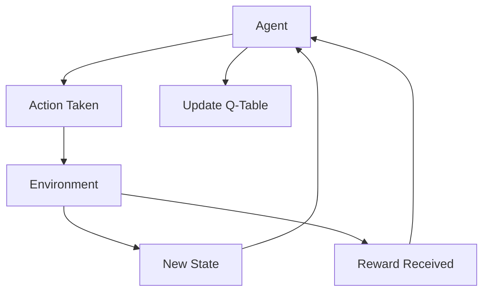
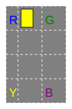

## 🚀 Introduction

In this tutorial, we’ll implement **Q-Learning**, a foundational reinforcement learning algorithm, in Python using the **OpenAI Gym** library. Q-Learning is a popular method for training agents to make decisions in environments with discrete states and actions. Our agent will learn to maximize its rewards by exploring and exploiting different strategies over time.

### What is Q-Learning?
Q-Learning is a type of **model-free, off-policy algorithm** that uses a **Q-Table** to store information about the expected future rewards of different actions in each state. The agent updates this table iteratively based on the rewards it receives, gradually improving its understanding of which actions yield the highest rewards.

Q-Learning is ideal for discrete environments like OpenAI Gym’s **Taxi-v3** environment, where an agent (the taxi) learns to navigate a grid, pick up passengers, and drop them off at specified locations. The algorithm’s simplicity and flexibility make it a great starting point for understanding reinforcement learning.

**Why OpenAI Gym?**

**OpenAI Gym** provides a suite of simulated environments designed for reinforcement learning, making it an ideal tool for experimenting with RL algorithms like Q-Learning. Gym’s environments are easy to set up and come with clear action and state spaces, allowing us to focus on the algorithm itself without worrying about complex setup.

**Objectives**

By the end of this tutorial, you will:
1. Understand the core concepts of Q-Learning.
2. Implement a Q-Learning agent in Python.
3. Train the agent to navigate the Taxi-v3 environment.
4. Observe the agent’s learning progress and evaluate its performance.

___
## 🛠️ Setting Up the Environment 

To begin implementing our Q-Learning agent, we’ll need to install the **OpenAI Gym** library, which provides the Taxi-v3 environment we’ll use. Additionally, we’ll install **NumPy** to manage numerical operations in our Q-Learning algorithm.

1. **Installing Libraries**

If you don’t already have Gym and NumPy installed, you can install them using the following command in your terminal or command prompt:

```bash
pip install gymnasium numpy
```

This command installs both packages, allowing us to create and interact with the environment and manage the Q-Table for our Q-Learning agent.

2. **Initializing the Taxi-v3 Environment**

OpenAI Gym’s **Taxi-v3** environment is a simple grid-based environment where an agent (a taxi) must:
1. Navigate a grid world to find a passenger.
2. Pick up the passenger.
3. Deliver the passenger to a specified destination.

<div class="text-center">


</div>

The agent’s goal is to maximize its cumulative reward by successfully completing pickup and drop-off tasks while minimizing penalties for illegal actions.


Link: [Taxi V3 full code](https://github.com/Andnog/Tutorials-Resources/blob/main/Reinforcement_learning/Q-Learning_Python/taxiv3.py)



Let’s start by importing Gym and setting up our environment:

```python
import gymnasium as gym
import numpy as np

# Initialize the Taxi-v3 environment with render_mode set to "ansi" for text-based output
env = gym.make("Taxi-v3", render_mode="ansi")
env.reset()
```

This code sets up the Taxi-v3 environment and resets it to the initial state, preparing it for interaction with the agent.

3. **Exploring the Environment**

It’s helpful to understand the structure of the Taxi-v3 environment, including its **action space** (possible moves) and **state space** (different configurations of the taxi, passenger, and destination). We can examine the environment with these commands:

```python
# Check the number of possible actions
print("Action Space:", env.action_space)

# Check the number of possible states
print("State Space:", env.observation_space)
```
<blockquote>
 Output: <hr class="m-0-imp"> 
Action Space: Discrete(6) <br>
State Space: Discrete(500)
</blockquote>


- **Action Space**: Taxi-v3 has six discrete actions, including moving in four directions, picking up, and dropping off the passenger.
- **State Space**: There are 500 discrete states, representing all combinations of taxi positions, passenger locations, and destinations.

4. **Visualizing the Environment**

OpenAI Gym allows us to visualize the environment, which is particularly useful for understanding the agent’s interactions. Use the following code to render the initial state of the environment:

```python
# Render the initial state
env.render()
```

This command displays a simple ASCII representation of the Taxi-v3 grid world:
- The **yellow block** represents the taxi’s position.
- **R, G, B, and Y** represent potential passenger pickup and drop-off locations.
- The **blue letter** represents the passenger’s initial location, and **magenta** represents the destination.

**Map**
```
    +---------+
    |R: | : :G|
    | : | : : |
    | : : : : |
    | | : | : |
    |Y| : |B: |
    +---------+
```

---

## 📘 Understanding the Q-Learning Algorithm 

**Q-Learning** is a type of reinforcement learning algorithm where an agent learns a policy to maximize cumulative rewards by creating a **Q-Table**. The table keeps track of the agent’s expected rewards for each possible action in each state, guiding it toward more rewarding actions over time.

1. **The Q-Table**

The **Q-Table** is at the core of Q-Learning. It’s a matrix where:
- **Rows** represent the possible states in the environment.
- **Columns** represent the actions available in each state.

Each cell in the Q-Table contains a **Q-value**, representing the expected reward for taking a specific action in a specific state. The agent updates these Q-values as it interacts with the environment, gradually improving its policy.

**Example:**

In the Taxi-v3 environment:
- Rows (states) represent each unique configuration of the taxi, passenger, and destination.
- Columns (actions) represent moves like up, down, pick-up, and drop-off.
  
The agent will update the Q-values in this table using feedback from the environment.

2. **Key Parameters in Q-Learning**

Several parameters influence how the Q-Learning algorithm functions:

- **Learning Rate (α)**: This parameter controls how much the agent values new information over old information. A high learning rate (closer to 1) means the agent learns quickly, while a low learning rate (closer to 0) results in slower learning.

- **Discount Factor (γ)**: The discount factor determines the importance of future rewards. A high discount factor (closer to 1) encourages the agent to consider future rewards, while a low discount factor makes it focus more on immediate rewards.

- **Exploration Rate (ε)**: Known as the epsilon parameter, the exploration rate controls the balance between **exploration** (trying new actions) and **exploitation** (using known actions with high rewards). A higher exploration rate encourages the agent to try new actions, while a lower rate focuses on maximizing rewards based on current knowledge.

3. **The Q-Learning Update Rule**

The agent updates its Q-values based on the **Q-Learning update formula**, which accounts for the reward received and the estimated value of future states. Here’s the formula:

\[
Q(s, a) = Q(s, a) + \alpha \times (R + \gamma \times \max Q(s', a') - Q(s, a))
\]

Where:
- **\( Q(s, a) \)** is the current Q-value for the state-action pair.
- **\( R \)** is the reward received after taking action **\( a \)** in state **\( s \)**.
- **\( \max Q(s', a') \)** is the maximum Q-value for the next state **\( s' \)**, representing the best future reward.
- **\( \alpha \)** is the learning rate.
- **\( \gamma \)** is the discount factor.

{}
**Explanation**: The agent updates the Q-value for the current state-action pair by considering the immediate reward and the expected value of future rewards. Over time, this iterative updating helps the agent build an optimal policy for maximizing cumulative rewards.
{}

**Setting Parameters for Our Agent**

In our implementation, we’ll set the following initial values for these parameters:

```python
alpha = 0.1       # Learning rate
gamma = 0.9       # Discount factor
epsilon = 0.1     # Exploration rate
epsilon_decay = 0.99  # Decay rate for epsilon
episodes = 1000   # Number of training episodes
```

**Why These Parameters Matter**

- **Learning Rate (α)** ensures the agent doesn't completely overwrite previous knowledge, providing a balanced approach to updating Q-values.
- **Discount Factor (γ)** encourages the agent to focus on long-term rewards, essential for achieving the goal of picking up and dropping off passengers efficiently.
- **Exploration Rate (ε)** helps the agent avoid getting stuck in suboptimal actions, especially early in training, by encouraging it to try new moves.




---

## 👨‍💻 Implementing Step-by-Step 

**Step 1: Setting Up the Q-Table**

The **Q-Table** will store Q-values for each state-action pair, guiding the agent toward optimal decisions. Since the Taxi-v3 environment has discrete states and actions, we can initialize the Q-Table as a 2D NumPy array filled with zeros.

```python
# Initialize the Q-Table with zeros
Q = np.zeros([env.observation_space.n, env.action_space.n])
```

- **Rows** in `Q` represent each possible state in the environment.
- **Columns** represent the actions available in each state.

**Step 2: Defining Parameters**

To control the learning process, let’s define the learning rate (alpha), discount factor (gamma), exploration rate (epsilon), and the number of training episodes.

```python
# Parameters
alpha = 0.1       # Learning rate
gamma = 0.9       # Discount factor
epsilon = 0.1     # Exploration rate
epsilon_decay = 0.99  # Decay rate for epsilon
episodes = 1000   # Number of training episodes
```

**Step 3: Training the Agent**

The training loop is where the agent learns by interacting with the environment. Here, we’ll:
1. Reset the environment at the start of each episode.
2. Choose an action based on the **epsilon-greedy** policy.
3. Update the Q-Table based on the reward received and the expected future reward.

**Implementing the Training Loop**

```python
# List to store total rewards per episode for visualization
reward_list = []

# Training the agent
for episode in range(episodes):
    state, _ = env.reset()
    done = False
    total_rewards = 0  # Track total rewards for this episode

    while not done:
        # Epsilon-greedy action selection
        if np.random.uniform(0, 1) < epsilon:
            action = env.action_space.sample()  # Explore
        else:
            action = np.argmax(Q[state])  # Exploit

        # Take the action, observe reward and next state
        next_state, reward, done, truncated, _ = env.step(action)
        total_rewards += reward

        # Q-Learning update
        Q[state, action] = Q[state, action] + alpha * (reward + gamma * np.max(Q[next_state]) - Q[state, action])

        # Move to the next state
        state = next_state

    # Append total rewards for this episode to the reward list
    reward_list.append(total_rewards)
```

**Explanation of Key Components**
- **Epsilon-Greedy Action Selection**: Balances exploration and exploitation. With a probability of epsilon, the agent selects a random action (explore), otherwise, it selects the action with the highest Q-value in the current state (exploit).
- **Q-Table Update**: Each Q-value is updated based on the immediate reward and the maximum expected future reward, gradually refining the table with each interaction.
- **Loop until Done**: The inner loop continues until the episode ends, either by dropping off the passenger or reaching a maximum step count.

**Step 4: Decaying Exploration Rate (Optional)**

As the agent learns, we may want it to rely more on exploitation rather than exploration. One way to do this is by gradually reducing the epsilon value:

```python
# Reduce epsilon over time
epsilon_decay = 0.99
for episode in range(episodes):
    # Training code here
    ...

    epsilon *= epsilon_decay
```

{}
This optional step gradually shifts the agent’s behavior from exploration to exploitation as training progresses.
{}

Now that we've trained our agent, let’s move on to the **Testing the Agent** section. This section will demonstrate how to evaluate the agent’s performance in the Taxi-v3 environment using the Q-Table it has learned.

---

## 🧪 Testing the Agent 

After training, the Q-Table should contain optimal (or near-optimal) values for each state-action pair. Now, we can test the agent by allowing it to navigate the environment using the learned Q-Table without further exploration. This means the agent will choose the action with the highest Q-value in each state.

**Step 1: Run a Test Episode**

Let’s write a script to run one episode where the agent only exploits the knowledge in the Q-Table.

```python
# Reset the environment to start a new episode
state = env.reset()
done = False
total_rewards = 0

print("\nTesting the agent's performance:")
while not done:
    # Select the action with the highest Q-value in the current state
    action = np.argmax(Q[state])
    
    # Take the action and observe the reward and next state
    next_state, reward, done, truncated, _ = env.step(action)
    total_rewards += reward

    # Render the environment in text mode to visualize the agent's actions
    print(env.render())
    
    # Move to the next state
    state = next_state

print("Total Rewards:", total_rewards)
```

**Explanation of the Testing Code**

1. **Resetting the Environment**: We reset the environment to initialize the episode.
2. **Exploiting the Q-Table**: For each step, the agent selects the action with the highest Q-value in the current state.
3. **Environment Rendering**: The `env.render()` function visually displays each step the agent takes, showing the taxi’s movements in the grid.
4. **Tracking Rewards**: `total_rewards` accumulates the rewards the agent receives throughout the episode, allowing us to evaluate the agent’s performance.

**Observing Results**

In the rendered environment:
- The **taxi’s position** updates as it navigates the grid.
- **Passenger locations** and **destination points** are shown as specific letters (e.g., “R” for Red, “G” for Green).
- **Completed episodes** will display the agent reaching the destination and successfully dropping off the passenger.

A high cumulative reward indicates that the agent has successfully learned an efficient policy for picking up and dropping off passengers. If `total_rewards` is low, further tuning of parameters or additional training episodes may be required.

**Render example**

<div class="text-center">



</div>

---

## 📊 Visualizing the Agent’s Learning Progress

Visualizing the agent’s progress can help us better understand how well it’s learning and identify any potential areas for improvement. Here, we’ll track the **total rewards** received by the agent in each episode during training, which gives us an indication of how efficiently it’s completing tasks over time.

**Step 1: Modifying the Training Loop to Track Rewards**

Let’s update our training loop to store the total rewards for each episode in a list. This will allow us to plot the rewards after training is complete.

```python
# List to store total rewards per episode
# List to store total rewards per episode for visualization
reward_list = []

# Training the agent
for episode in range(episodes):
    state, _ = env.reset()
    done = False
    total_rewards = 0  # Track total rewards for this episode

    while not done:
        # Epsilon-greedy action selection
        if np.random.uniform(0, 1) < epsilon:
            action = env.action_space.sample()  # Explore
        else:
            action = np.argmax(Q[state])  # Exploit

        # Take the action, observe reward and next state
        next_state, reward, done, truncated, _ = env.step(action)
        total_rewards += reward

        # Q-Learning update
        Q[state, action] = Q[state, action] + alpha * (reward + gamma * np.max(Q[next_state]) - Q[state, action])

        # Move to the next state
        state = next_state

    # Decay epsilon after each episode
    epsilon *= epsilon_decay

    # Append total rewards for this episode to the reward list
    reward_list.append(total_rewards)
```

**Step 2: Plotting the Rewards Over Episodes**

Now that we’re tracking rewards for each episode, let’s visualize the learning curve. Ideally, we should see an upward trend in rewards over time, indicating that the agent is improving.

```python
import matplotlib.pyplot as plt

# Plot total rewards per episode
plt.plot(reward_list)
plt.xlabel("Episodes")
plt.ylabel("Total Rewards")
plt.title("Agent's Learning Progress")
plt.show()
```

This plot shows the **total rewards** for each episode, providing insights into the agent’s learning trajectory. A rising trend in total rewards suggests that the agent is learning to complete tasks more effectively.

**Interpreting the Learning Curve**

1. **Increasing Rewards**: If the rewards gradually increase over episodes, this indicates the agent is improving and finding more efficient paths to the goal.
2. **Flat or Decreasing Rewards**: If rewards remain flat or decrease, it could mean that the agent isn’t learning effectively. In such cases, adjusting parameters (e.g., learning rate, discount factor) or extending the number of episodes may help.

<div class="image-bg">


</div>

**Optional: Smoothing the Learning Curve**

Since rewards can fluctuate, you may consider smoothing the curve for better visualization. This can be done by averaging rewards over a sliding window.

```python
# Smoothing the curve with a rolling average
window_size = 50
smoothed_rewards = [np.mean(reward_list[i-window_size:i+1]) if i >= window_size else np.mean(reward_list[:i+1]) for i in range(len(reward_list))]

plt.plot(smoothed_rewards)
plt.xlabel("Episodes")
plt.ylabel("Average Total Rewards")
plt.title("Smoothed Learning Progress of the Agent")
plt.show()
```

<div class="image-bg">


</div>

---

## 🔍 Conclusion & Next Steps 

**Summary**

In this tutorial, we built a reinforcement learning agent using the **Q-Learning** algorithm in Python. Here’s a recap of what we covered:

1. **Setting Up the Environment**: We used **OpenAI Gym’s Taxi-v3** environment, where the agent learns to pick up and drop off passengers.
2. **Understanding Q-Learning**: We explored the core concepts, including the **Q-Table**, **learning rate**, **discount factor**, and **exploration-exploitation balance**.
3. **Implementing Q-Learning**: We implemented a Q-Learning training loop, allowing the agent to learn through episodes and iteratively update its Q-values.
4. **Testing and Visualization**: We evaluated the agent’s performance by running a test episode and visualized the learning curve, observing the agent’s progress over time.

**Results and Interpretation**

The agent’s learning progress was tracked using a plot of total rewards per episode. Ideally, we observed an upward trend in rewards, indicating improved task completion efficiency. This result demonstrates that the agent learned to navigate the environment and complete the tasks effectively.

**Next Steps**

To take this project further, consider the following expansions:

1. **Experiment with Hyperparameters**: Adjust the learning rate, discount factor, and exploration rate to see how they affect the agent’s performance.
   
2. **Epsilon Decay**: Implement a more sophisticated decay schedule for epsilon, gradually reducing exploration as the agent becomes more confident in its policy.

3. **Implement Different RL Algorithms**: Try other reinforcement learning algorithms, such as SARSA or Deep Q-Networks (DQNs), which use neural networks for environments with continuous state spaces.

4. **Apply to More Complex Environments**: Experiment with other OpenAI Gym environments, such as CartPole or MountainCar, where the state and action spaces are larger and more complex.

5. **Add Logging and Metrics**: Track additional metrics, such as average steps per episode, to gain deeper insights into the agent’s performance.

By exploring these next steps, you can expand your understanding of reinforcement learning and improve the agent’s performance in diverse environments.